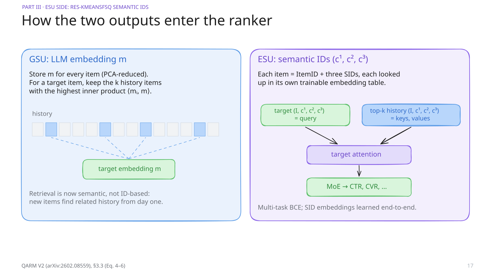
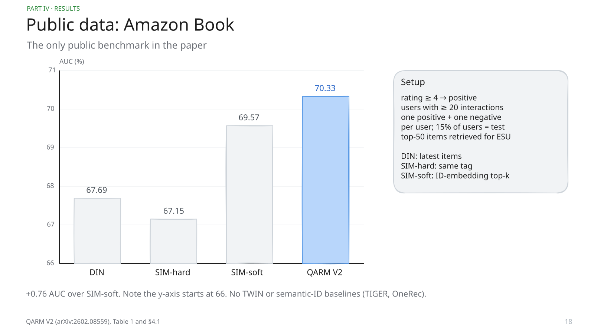
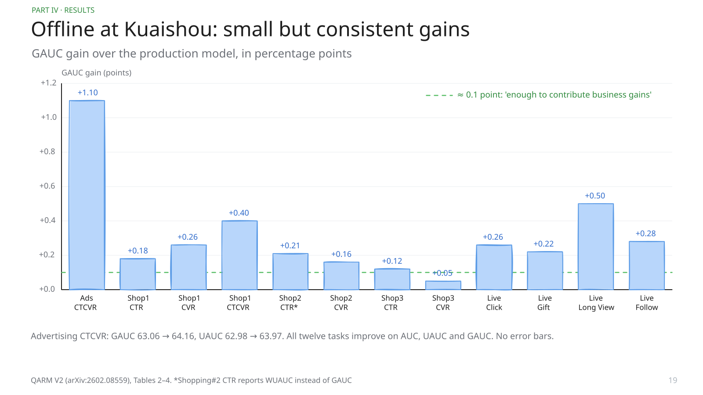
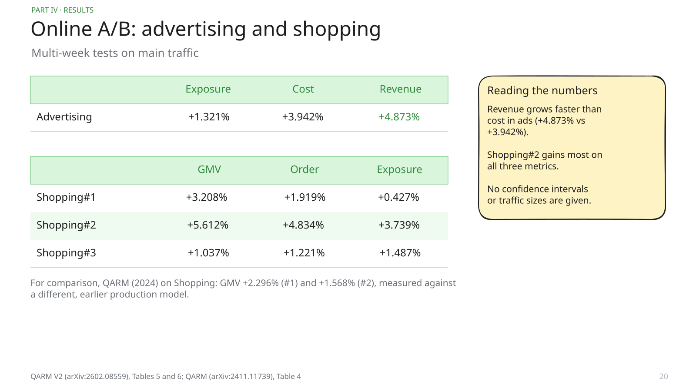
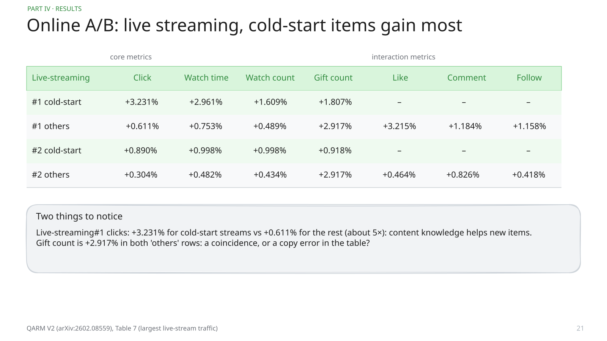
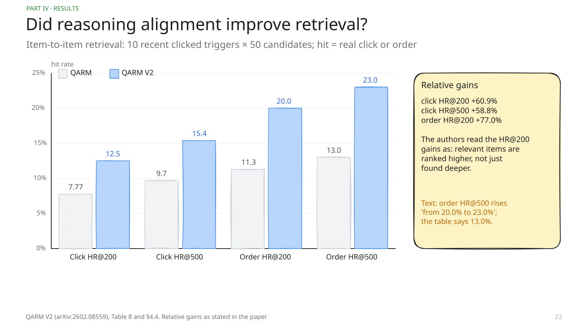
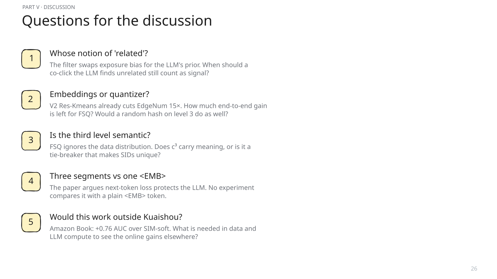

# Speaker notes — QARM V2: Quantitative Alignment Multi-Modal Recommendation for Reasoning User Sequence Modeling

Paper club · 8 October 2026 · arXiv:2602.08559 (predecessor: arXiv:2411.11739)

## 1. title

QARM V2 from Kuaishou, February 2026, with its predecessor QARM from November 2024. Both are industrial papers about one question: how to make an LLM's understanding of items useful inside a production recommender. The row at the bottom is the whole system: an LLM reads the item, produces an embedding used for retrieval and semantic IDs used for ranking.

## 2. tldr

Problem: naive LLM embeddings help a recommender only a little, for two reasons the authors name representation unmatch and representation unlearning. Fixes: on the retrieval side, better alignment data and a new way to fine-tune the LLM; on the ranking side, a hybrid quantizer. Evidence: online A/B gains of several percent, offline GAUC gains of 0.05 to 1.1 points, and far fewer code collisions. Keep in mind for the discussion: there are almost no ablations.

## 3. glossary models

Reference slide; skip or go fast. GSU/ESU come from SIM (Pi et al., CIKM 2020, Alibaba). TWIN (Chang et al., KDD 2023) and TWIN V2 (Si et al., CIKM 2024) are Kuaishou's lifelong models: TWIN makes the GSU use the same relevance score as the ESU's attention; V2 compresses ultra-long histories by clustering. DIN (Zhou et al., KDD 2018) attends over recent behaviour. Swing (Alibaba) scores item pairs by users who clicked both, down-weighting very active user pairs. TIGER (Rajput et al., 2023) and OneRec (Kuaishou, 2025) generate semantic IDs instead of scoring items.

## 4. glossary metrics

Reference slide. FSQ is from Mentzer et al. (2023), 'VQ-VAE made simple': no learned codebook, just bounded dimensions rounded to a few levels. Offline metrics are in percent, so +0.1 means 0.1 AUC points. GAUC is the standard industrial metric because global AUC mixes users with very different base rates. GMV is the total value of orders; exposure is how often items are shown.

## 5. setting

Kuaishou is a short-video and live-streaming platform with more than 400 million daily active users and tens of millions of new items every day. Active users have more than 100,000 interactions. A ranking model cannot attend over all of them for every candidate, so lifelong models first select a short subsequence. Items are rich multimodal objects, which is why an LLM can help.

## 6. gsu esu

The standard paradigm since SIM (2020): a cheap General Search Unit picks the top-K history items related to the target; an Exact Search Unit runs target attention over them and is trained end-to-end. Everything depends on what 'related' means. SIM-hard uses the same category tag; SIM-soft and TWIN use ID-embedding similarity. QARM V2 replaces this with LLM-embedding similarity in the GSU and adds semantic-ID features in the ESU.

## 7. ids vs llm

The paper's Figure 1 in table form. IDs: billions of them, growing; knowledge lives in their embeddings and is lost when an item disappears; the model must keep training on fresh data. LLMs: a fixed vocabulary, knowledge in deep layers, stable after training. Small inconsistency: the text says fewer than 20,000 token IDs, the figure says about 1e5.

## 8. naive llm

The common industrial practice is to cache an LLM embedding per item and add it as a feature. The authors argue this has a low ceiling. Unmatch: pre-training similarity is visual or textual, so toothpaste and ointment look alike. Unlearning: a cached vector gets no gradient. The quote at the bottom is the paper's own framing: recommendation is about discovering new interests, not look-alikes.

## 9. qarm v1

QARM (2024) already had both ideas. Item alignment: fine-tune a multimodal LLM contrastively on item pairs exported from Kuaishou's own retrieval models, so its similarity becomes business similarity. Quantitative codes: turn the embedding into discrete IDs (VQ: the IDs of the 25 nearest items; RQ: six levels of residual K-means) that the ranker can learn embeddings for. Their Table 1 is the key evidence for 'unlearning': the aligned embedding as a frozen feature gave +0.02 AUC, the codes +0.18.

## 10. qarm v1 results

QARM's numbers, for context. Offline: codes help, the frozen embedding barely does. Online: up to +9.7% ads revenue on cold-start items and +1.6 to +2.3% GMV in shopping. The long-tail table is the most interesting: the least-purchased items (L1) gained +8.0% GMV. That is the generalization argument: content features help items with little interaction history.

## 11. what changes

Four changes. Data: filter the item pairs with a reasoning LLM and add generated QA pairs. Model: a decoder-only LLM trained with a three-segment mask so it learns contrastive and next-token losses together. Codes: drop VQ, keep two K-means levels, replace the last level with FSQ. Usage: the embedding goes to the GSU for retrieval, the SIDs to the ESU.

## 12. noisy pairs

Why filter? The pairs come from retrieval models trained on clicks, so they inherit their biases. Swing pairs two hot items that everyone clicks, like soy sauce and laundry detergent: exposure bias, no relation. Two-tower pairs are looser: some are noise, some are exactly the cross-category relations we want, like boots and a down jacket bought for the same season. A reasoning LLM decides.

## 13. data pipeline

Two data streams. A: pair filtering with Qwen3 reasoning models on titles and attributes only; the cheap 0.6B model for the stable Swing pairs, the 8B model for the noisy two-tower pairs. They reject over 10% and over 70% respectively. B: QA generation with Gemini and Qwen2.5-VL-72B from the full multimodal item, ten questions per item. The QA data feeds the generative loss on the next slide.

## 14. three segment

The usual way to get an embedding from a decoder-only LLM is one special <EMB> token whose last hidden state is the embedding; that replaces next-token prediction with compression. QARM V2 splits the sequence into three segments with a custom mask: input tokens see only themselves; several <EMB> tokens see the input; QA tokens see only the <EMB> tokens and earlier QA tokens. The mean of the <EMB> states gets an in-batch contrastive loss; the answer gets a next-token loss. Because QA cannot see the input, the embedding must carry the item information. A warm start lets QA see the input at first and anneals that to zero. There is no experiment isolating this trick.

## 15. collisions

Now the ranking side. QARM's three-level residual K-means gave many collisions: more than 30% of SIDs map to several items in shopping. The explanation: the catalogue is long-tailed, K-means places centroids where the data is dense, so tail items share few centroids. FSQ rounds each dimension to fixed levels, so the grid is independent of the data. The picture is synthetic (420 points, 16 K-means centroids computed for real), redrawn from the paper's Figure 4.

## 16. res kmeans fsq

Keep K-means for the first two levels, which the authors find already identify category and usage; use FSQ on the second residual for item-specific detail. FSQ: project with a learned d×13 matrix, squash with a sigmoid, scale by L and round. Check the sizes with the group: with L = 2 and binary dimensions, 2^13 = 8192 codes, matching K = 8192; but round(2·sigmoid) gives three values, and the experiments say '3 × 4096'. The paper does not resolve this.

## 17. usage

GSU: the LLM embedding of every item is stored (PCA-reduced); for a target, the top-k history items by inner product are kept. ESU: each item is its ItemID plus three SIDs, each with a trainable embedding table; the target is the query, the retrieved history the keys and values; a multi-task MoE predicts CTR, CVR and so on, trained with binary cross-entropy. So the embedding is frozen in the GSU, and the learnable part sits in the SIDs, which addresses 'unlearning'.

## 18. amazon

The only public benchmark. Amazon Book, ratings 4 and above as positives, users with at least 20 interactions, one positive and one negative per user, 15% of users for test, top-50 retrieved for the ESU. QARM V2 reaches 70.33 AUC versus 69.57 for SIM-soft. The axis starts at 66 so the bars look bigger than they are. The baselines are old; no TWIN, no generative semantic-ID models.

## 19. offline

Offline on Kuaishou data, against the production model. Every task improves on every metric. The bars show GAUC gains: from +0.05 (Shopping#3 CVR) to +1.10 (Advertising CTCVR). The authors say about 0.1 points is enough to matter for business, which is common wisdom in industrial CTR work. No variance or significance is reported.

## 20. online ads shop

Online A/B tests over several weeks. Advertising: revenue +4.873% with cost +3.942%, so revenue grows faster than spend. Shopping: GMV +1.0% to +5.6%, with Shopping#2 the biggest winner. QARM's gains are not directly comparable, because the production baseline has changed since then.

## 21. online live

Live streaming, split by cold-start and other streams. In Live-streaming#1, cold-start click is +3.231% versus +0.611% for the rest: about five times more, which supports the generalization story. Curiosity: gift count is +2.917% in both 'others' rows; possibly a coincidence, possibly a copy error.

## 22. alignment hr

Does the filtered alignment improve the embedding itself? An item-to-item retrieval test: for each user take the 10 most recent clicked items, retrieve 50 candidates each, and count hits against real clicks and orders. QARM V2 improves every cut-off by roughly 60 to 77% relative; the larger gain at HR@200 means relevant items move up. Note the text says order HR@500 went from 20.0 to 23.0, while the table says 13.0.

## 23. code conflict

Collisions measured directly with a reverse lookup from SID to item IDs. The surprising part: with the same Res-Kmeans quantizer, the new embeddings alone cut items-per-SID from 129 to 8.4 and raise HR@1 from 80% to 92%. FSQ then takes items-per-SID to 2.5 and collisions to 32%. So the new embeddings do more for collisions than the quantizer. Also: 32% of items still share a SID.

## 24. gsu case

Qualitative check of the GSU. Exclusive rate: about 60% of what QARM V2 retrieves from the history is not retrieved by the ID-based SIM GSU. The authors' case study shows SIM pulling unrelated items, e.g. jewellery for a phone accessory. Side finding worth discussing: they do not deduplicate sequences, because repeated interactions with the same author carry signal; deduplication lowered offline AUC.

## 25. critique

Strengths: real deployment across three businesses with A/B tests, ideas that transfer, and a direct measurement of collisions. Weaknesses: the three contributions are never ablated on ranking metrics; baselines are weak on public data; no confidence intervals; and several numbers disagree between text, tables and figures. The filter LLM also sees only titles and attributes, so its idea of 'related' is shallow for videos and live streams.

## 26. questions

Five questions to open the discussion. Pick two or three depending on time. The second one is the most concrete: Table 9 suggests most of the collision gain comes from the embeddings, not FSQ.

## 27. takeaways

Four lines to remember. LLM knowledge enters a ranker as an embedding for retrieval and as learnable semantic IDs for ranking. Better embeddings (new data and training) did more for code quality than the quantizer. Collision rate and items-per-SID are cheap diagnostics. And the paper is convincing on deployment but not on attribution.

