# Speaker notes — QARM V2: Quantitative Alignment Multi-Modal Recommendation for Reasoning User Sequence Modeling

Paper club · 8 October 2026 · arXiv:2602.08559 (predecessor: arXiv:2411.11739)

The story in six sentences:

1. Kuaishou's recommender must predict what each user clicks or buys next, from a history of 100,000+ interactions.
2. It does this in two steps: the GSU picks the few past items related to the candidate (target) item, then the ESU looks at them closely.
3. Both steps need to know which items are "related"; ID embeddings are bad at that, especially for new (cold-start) items.
4. LLM embeddings understand items, but suffer from representation unmatch (the LLM's "similar" is not the business's "similar") and representation unlearning (a frozen embedding cannot be trained by the recommender).
5. QARM V2 fixes unmatch with reasoning item alignment (cleaned item pairs + a three-segment training trick), and unlearning with Res-KmeansFSQ semantic IDs that the ESU learns end-to-end.
6. It works in production (several percent more revenue and GMV), but the paper does not show which part of the recipe causes the gains.

---

## 1. title

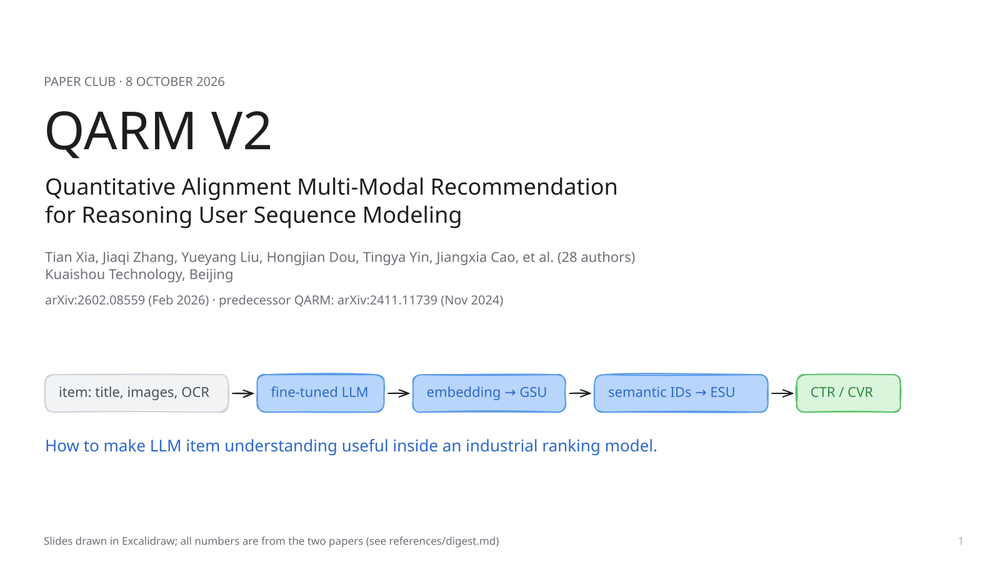

Terms: LLM embedding = one vector per item computed by an LLM. Semantic ID (SID) = the same item written as three short discrete codes. GSU / ESU = the two steps of the recommender (explained on slide 3).

Say: Today's paper is QARM V2 from Kuaishou, the Chinese short-video and live-streaming platform. It follows QARM from 2024, so we look at both.

Point to the row of boxes: the whole paper in one line. A fine-tuned LLM reads an item (title, images, OCR text). It produces an LLM embedding, which the GSU uses to find related items, and semantic IDs, which the ESU learns from. At the end the model predicts CTR and CVR, click and purchase.

Bridge: Here is the paper in one slide.

## 2. tldr

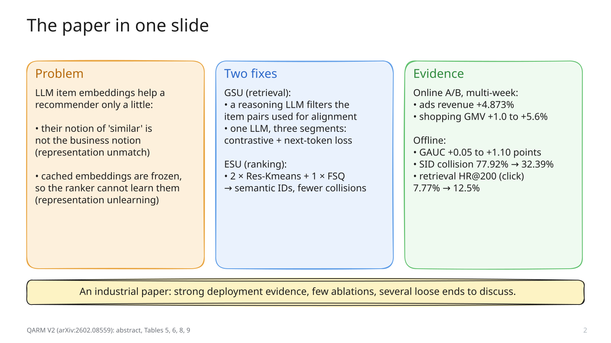

Terms: representation unmatch, representation unlearning (the paper's two problem names). Res-Kmeans, FSQ (two quantizers that produce semantic IDs). GAUC (ranking quality per user). SID collision (two items getting the same semantic ID).

Say: Read the three boxes left to right.

Problem: adding LLM embeddings to a recommender usually helps only a little. Reason one, representation unmatch: the LLM calls items similar when they look alike, but the business cares about items people use or buy together. Reason two, representation unlearning: the LLM embedding is frozen, so the recommender's training cannot adjust it.

Two fixes, one per problem. On the GSU side, clean the alignment pairs with a reasoning LLM and train the LLM with a three-segment trick. On the ESU side, turn the embedding into semantic IDs with two levels of Res-Kmeans plus one level of FSQ, so fewer items collide.

Evidence: online A/B tests with several percent more revenue and GMV, GAUC gains offline, and far fewer SID collisions.

Point to the yellow line: strong results, but almost no ablations showing which part does the work.

Bridge: Two slides of vocabulary first; I will go quickly.

## 3. glossary models

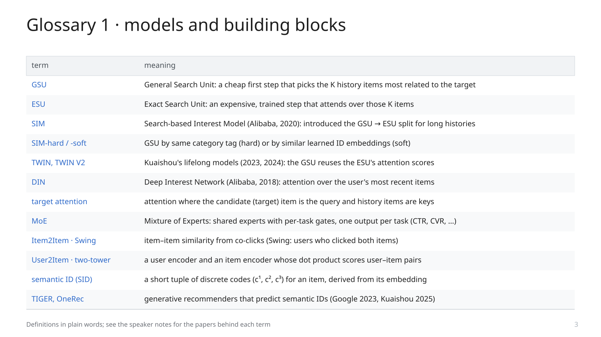

Terms: everything on this slide is a term; four of them matter today.

Say: GSU, General Search Unit: a quick filter that keeps the K past items most related to the candidate. ESU, Exact Search Unit: the careful step that attends over those K items and is trained with the rest of the model.

SIM is the 2020 Alibaba paper that introduced the GSU/ESU split. TWIN is Kuaishou's own version from 2023.

Semantic ID: an item written as a tuple of three codes, c1, c2, c3, coarse to fine, like a postal code.

Target attention: the candidate (target) item is the query that decides how much each history item counts.

The rest is reference; skip unless asked.

Bridge: The second glossary covers quantization and metrics.

## 4. glossary metrics

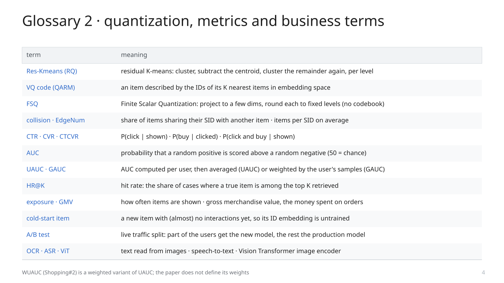

Terms: as on the slide.

Say: For the method part: Res-Kmeans clusters the embeddings, subtracts the cluster centre and clusters the rest again; FSQ rounds each dimension to a few fixed values, with no learned codebook.

For the results: CTR is P(click), CVR is P(buy after click). AUC is how well positives are ranked above negatives, 50 is chance. GAUC is AUC per user, averaged. In industry +0.1 GAUC is already worth money. GMV is the money spent on orders. HR@K is how often a true item is in the top K.

Bridge: Now the setting. Why is this hard at Kuaishou?

## 5. setting

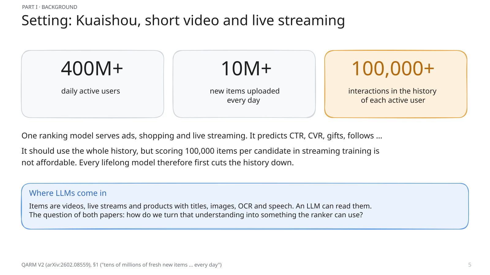

Terms: lifelong user sequence = the user's full interaction history. Streaming training = the model keeps training on new data all the time.

Say: Three numbers: 400 million daily active users, tens of millions of new items every day, and more than 100,000 interactions per active user.

The model should use that whole lifelong sequence, but scoring 100,000 items for every candidate in streaming training is far too expensive. So every lifelong model first cuts the history down.

Point to the blue box: items are not just IDs. They have titles, images, OCR and speech (ASR), which an LLM can read. Both papers ask how to turn that understanding into something the ranking model can use.

Bridge: How is the history cut down? With the GSU and ESU.

## 6. gsu esu

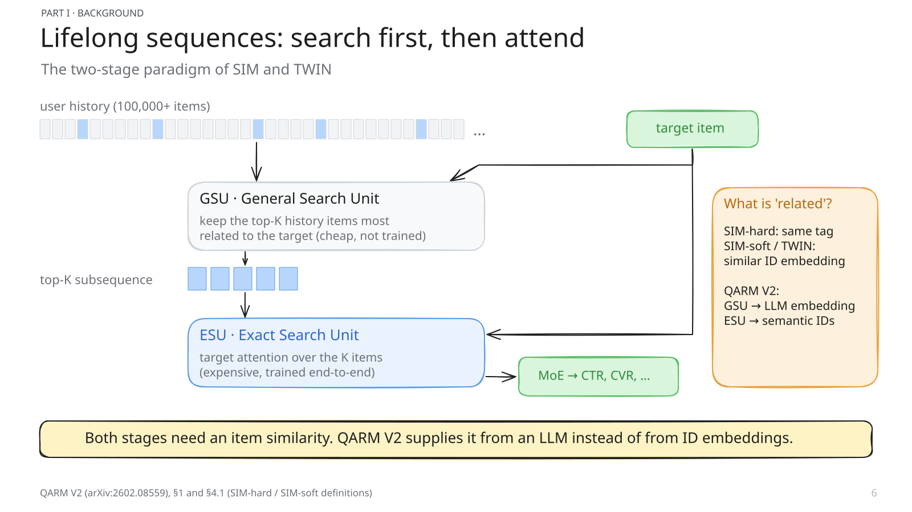

Terms: target item = the candidate being scored. GSU, ESU, top-K subsequence, target attention, MoE (one output head per task).

Say: The standard design for long histories, from SIM and TWIN.

Point top left: the user history. Point right: the target item.

GSU: a cheap search keeps the top-K history items most related to the target. Point to the blue squares: that is the top-K subsequence. The GSU is not trained.

ESU: target attention over those K items; the target is the query. Trained end-to-end, it feeds an MoE that predicts CTR, CVR and so on.

Point to the orange box: everything depends on what "related" means in the GSU. SIM-hard uses the same category tag; SIM-soft and TWIN use similar ID embeddings. QARM V2 uses the LLM embedding in the GSU and semantic IDs in the ESU.

Bridge: Why not keep using ID embeddings?

## 7. ids vs llm

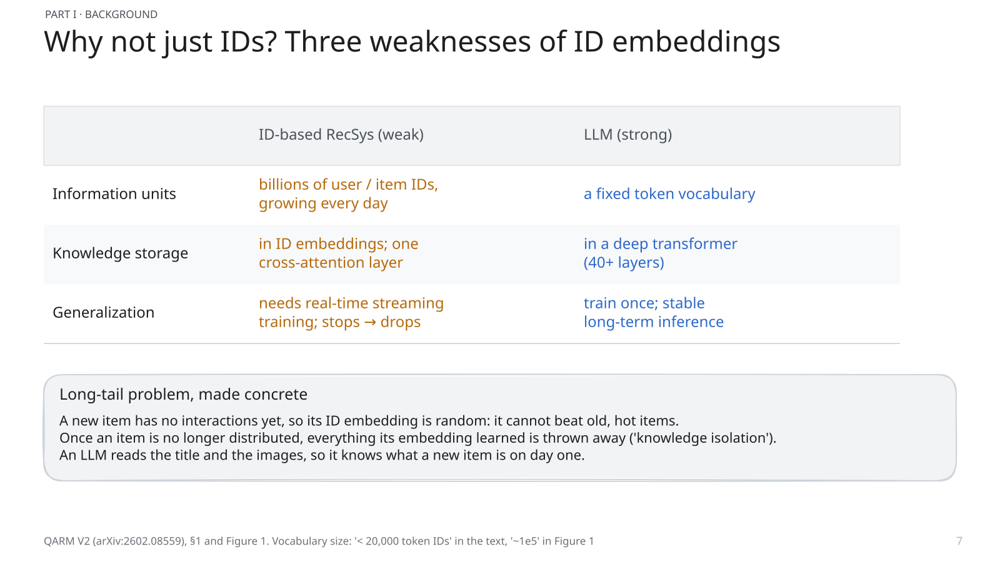

Terms: ID embedding = a vector learned from clicks for each item ID. Long-tail problem. Knowledge isolation. Cold-start item = a new item with no interactions.

Say: Three weaknesses of ID embeddings, one per row.

Information units: billions of IDs, growing daily, against a fixed LLM token vocabulary.

Knowledge storage: what an ID embedding learned lives only in that embedding; when the item is gone, the knowledge is gone. The paper calls this knowledge isolation. An LLM stores knowledge in 40+ transformer layers.

Generalization: ID embeddings need constant streaming training; an LLM stays stable once trained.

Point to the gray box: the long-tail problem made concrete. A cold-start item has no clicks, so its ID embedding is noise. An LLM reads its title and images on day one.

Bridge: So just add LLM embeddings? People did, and it helps less than you would hope.

## 8. naive llm

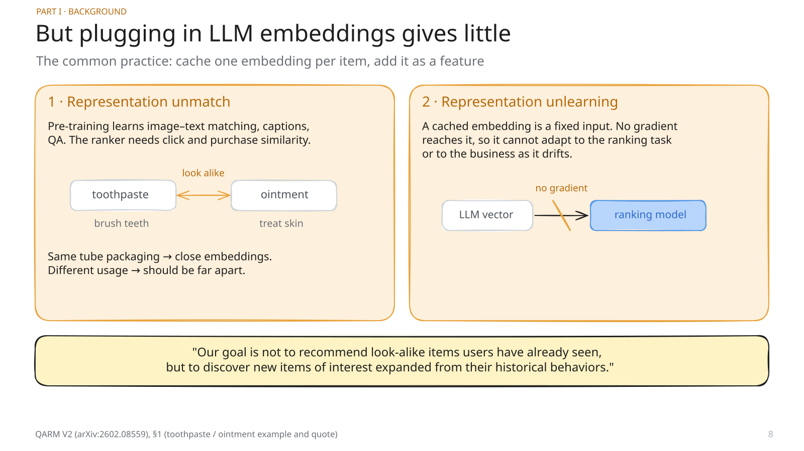

Terms: representation unmatch, representation unlearning (the two problems the whole paper is about).

Say: Common practice: compute one LLM embedding per item, cache it, add it as a feature. Two problems.

Representation unmatch, left: the LLM was pre-trained on image-text matching and captions, so toothpaste and ointment get close embeddings because both are tubes. For the business they are unrelated.

Representation unlearning, right: the cached embedding is a fixed input. No gradient reaches it, so it never adapts to the ranking task.

Point to the quote: the paper's goal. Do not recommend look-alikes; discover new interests.

Bridge: QARM (2024) already attacked both problems.

## 9. qarm v1

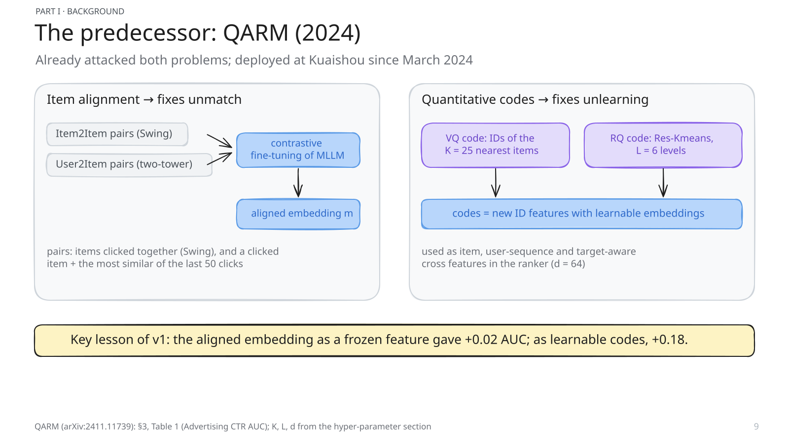

Terms: item alignment = fine-tune the LLM so items the business considers related get close embeddings. Item2Item (Swing) and User2Item (two-tower) = Kuaishou's retrieval models that export related item pairs. Contrastive loss = pull paired embeddings together, push others apart. Quantitative codes = QARM's name for semantic IDs. VQ code, RQ code (Res-Kmeans).

Say: Left, item alignment fixes unmatch. Take item pairs that Kuaishou's own retrieval models consider related: Item2Item pairs from Swing (clicked by the same users) and User2Item pairs from the two-tower model. Fine-tune the multimodal LLM with a contrastive loss so these pairs get close embeddings.

Right, quantitative codes fix unlearning. Turn each aligned embedding into discrete codes: a VQ code (the IDs of the 25 nearest items) and an RQ code (6 levels of Res-Kmeans). The ranking model gives each code a learnable embedding, so this part is trained end-to-end.

Point to the yellow line: the key evidence. As a frozen feature the aligned embedding gave +0.02 AUC; as learnable codes, +0.18, nine times more.

Bridge: QARM's results, since V2 is compared with it.

## 10. qarm v1 results

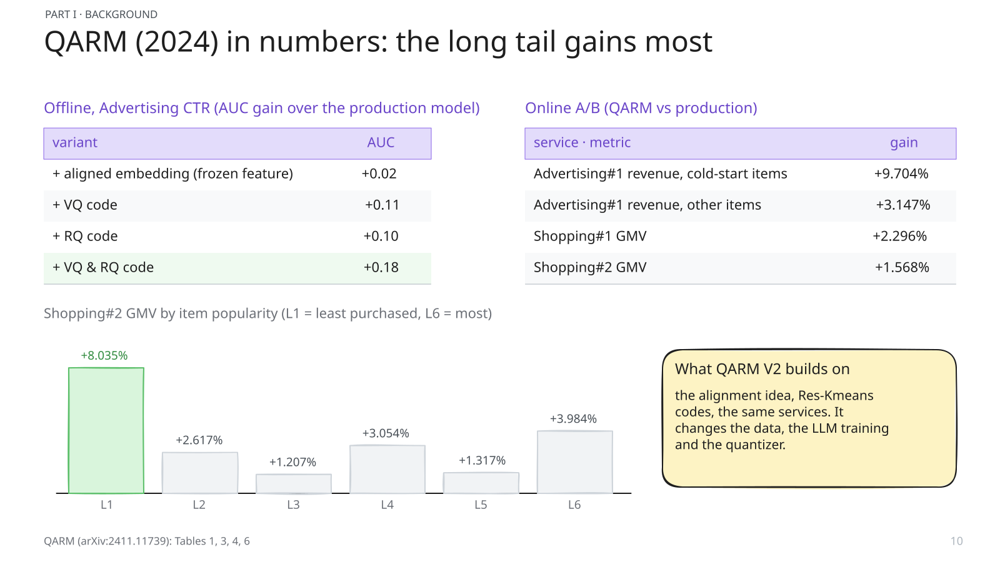

Terms: AUC gain, A/B test, GMV, cold-start, long tail (L1 = least purchased items).

Say: Top left: the frozen embedding barely helps; VQ and RQ codes help, both together most.

Top right: online A/B tests. Ad revenue +9.7% for cold-start ads and +3.1% for the rest. Shopping GMV +2.3% and +1.6%.

Point to the bar chart: items grouped from L1, least purchased, to L6, most purchased. The long-tail group L1 gained most, +8% GMV. Content knowledge helps items with little interaction history.

Bridge: What does V2 change?

## 11. what changes

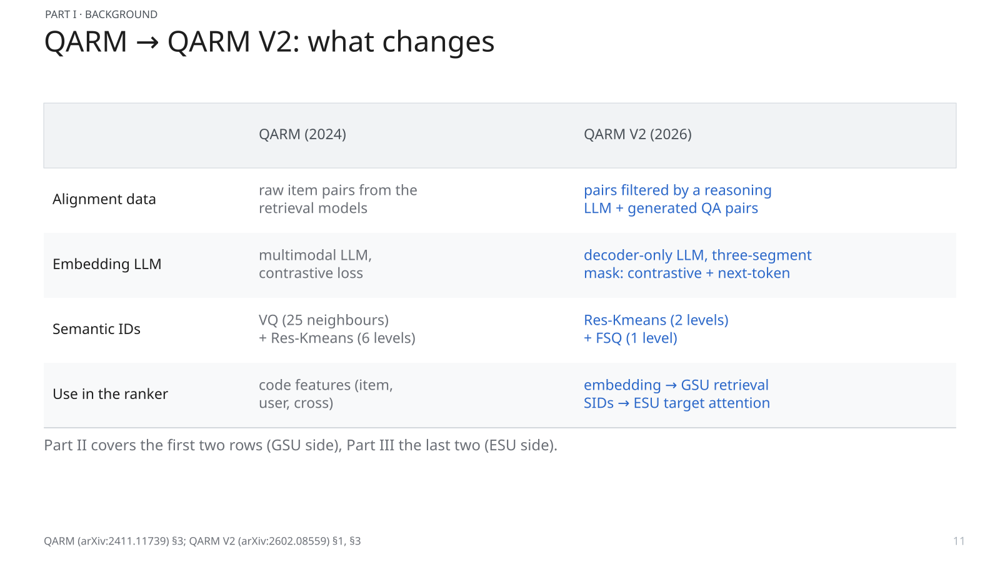

Terms: reasoning LLM, QA pairs, three-segment mask, contrastive + next-token loss, semantic IDs, Res-Kmeans, FSQ, GSU retrieval, ESU target attention.

Say: Four changes, one per row.

Alignment data: QARM used raw item pairs; V2 lets a reasoning LLM filter them and adds generated QA pairs about each item.

Embedding LLM: V2 uses a decoder-only LLM trained with a three-segment attention mask, so it learns a contrastive loss and the normal next-token loss together.

Semantic IDs: V2 drops the VQ code, keeps two levels of Res-Kmeans and replaces the last level with FSQ.

Use in the ranker: the LLM embedding goes to the GSU, the semantic IDs to the ESU.

Bridge: Part II covers the GSU side, rows 1 and 2. First: why filter the pairs?

## 12. noisy pairs

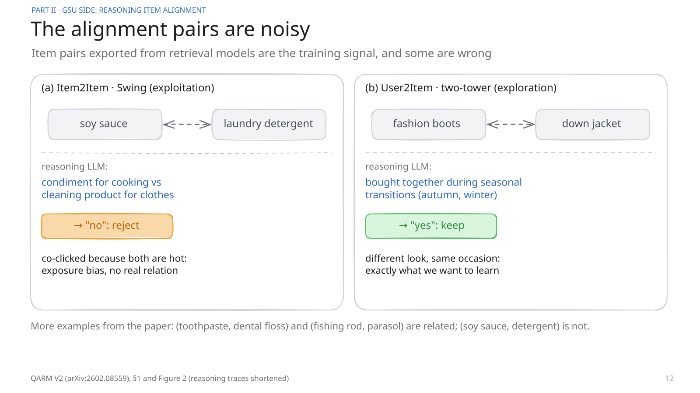

Terms: Item2Item Swing pairs (exploitation: stable co-click relations). User2Item two-tower pairs (exploration: looser relations). Exposure bias = popular items get shown and clicked more, so they look related to everything.

Say: The alignment pairs come from Kuaishou's retrieval models, so they inherit their mistakes.

Left, an Item2Item Swing pair: soy sauce and laundry detergent. Both are hot items, so many users click both; that is exposure bias, not a real relation. The reasoning LLM answers "no" and the pair is rejected.

Right, a User2Item two-tower pair: fashion boots and a down jacket. They look nothing alike, but people buy them together when the season changes. The LLM answers "yes" and the pair is kept. This is exactly the business similarity we want the LLM embedding to learn.

Bridge: The full reasoning data pipeline.

## 13. data pipeline

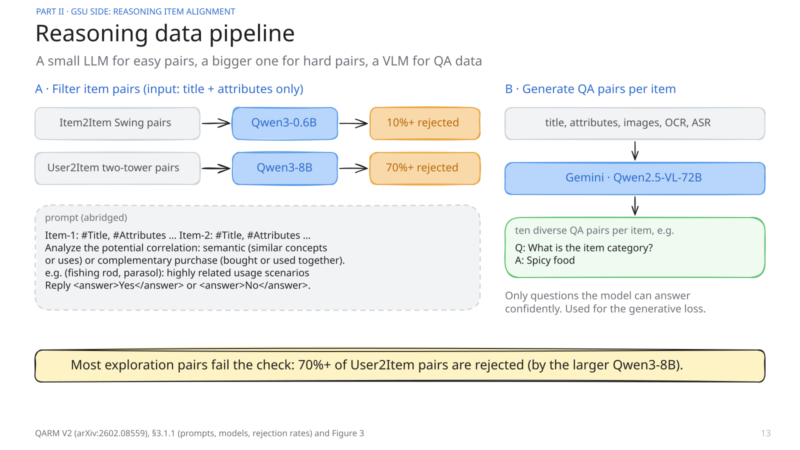

Terms: reasoning model (Qwen3) = an LLM that thinks step by step before answering. QA pairs = generated question-answer pairs about one item. VLM = vision-language model (Gemini, Qwen2.5-VL-72B).

Say: Two data streams.

A, pair filtering. Each pair goes to a Qwen3 reasoning model with titles and attributes only. The prompt asks: are these related by use, or bought together? Answer yes or no. The small Qwen3-0.6B handles the reliable Swing pairs, the larger Qwen3-8B the noisy two-tower pairs.

Point to the orange boxes: over 10% of Item2Item pairs and over 70% of User2Item pairs are rejected.

B, QA generation. A large VLM sees the whole item, including images, OCR and ASR, and writes ten QA pairs, for example "What is the item category? Spicy food."

Bridge: Both kinds of data train one LLM with the three-segment trick.

## 14. three segment

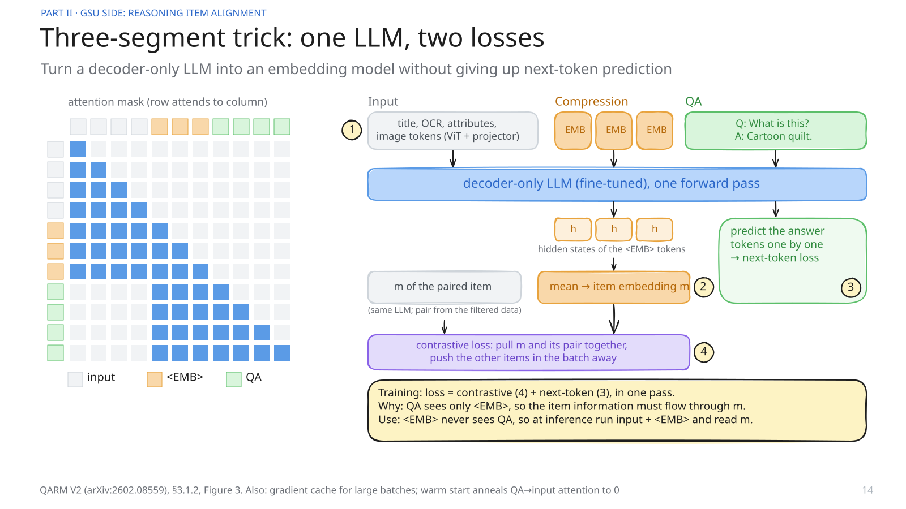

Terms: decoder-only LLM = a GPT-style model that predicts the next token. Attention mask = which tokens may look at which. <EMB> tokens = special tokens whose hidden states become the item embedding. Hidden state (h) = the LLM's output vector at one token position. Contrastive loss, next-token (generative) loss.

Say: The cleverest idea in the paper. Follow the yellow numbers 1 to 4 on the slide.

1. One sequence goes into the LLM in one pass. It has three parts:
   • the item itself (title, OCR, attributes, image tokens),
   • three special <EMB> tokens,
   • a question and its answer about the item ("Q: What is this? A: Cartoon quilt.").
   The attention mask on the left controls who can see what: <EMB> sees the item, and QA sees only <EMB>, never the item.

2. The LLM gives one output vector (hidden state) per token. Average the three vectors at the <EMB> positions, and that average is the item embedding m.

3. At the QA positions, the LLM must predict the answer word by word (the normal next-token loss). QA can't see the item, so the only way to answer "cartoon quilt" is through the <EMB> tokens. That forces m to contain the item's information.

4. The paired item from the filtered data goes through the same LLM and gets its own m. A contrastive loss pulls the two embeddings together and pushes the other items in the batch away. This teaches "business similarity".

Point to the yellow box: both losses are added and trained together. After training, <EMB> never looks at QA, so to get an embedding you only run the input plus the <EMB> tokens and read m.

Details if asked: a warm start lets QA see the input at first and anneals that attention to zero; gradient cache makes large contrastive batches fit in memory. No experiment compares this with a single <EMB> token.

Bridge: Part III, the ESU side. Why do semantic IDs collide?

## 15. collisions

Terms: code collision = several items share the same semantic ID. K-means centroid. Data-dependent vs data-independent quantization. FSQ grid.

Say: A semantic ID is useful only if it separates items. In QARM, many items collided.

Point left: a toy picture with real K-means on synthetic points. The catalogue is long-tailed: dense in the middle (common item types), sparse at the edges (rare items). K-means is data-dependent: it puts most centroids where the data is dense. Point to the dashed circle: most centroids sit there. Rare items at the edges share a few centroids, so they get the same semantic ID.

Point right: FSQ is data-independent; it cuts the space into a fixed grid, so sparse regions keep their own cells.

Point to the yellow line: with QARM's three-level Res-Kmeans, more than 30% of semantic IDs mapped to several items in Shopping.

Bridge: Res-KmeansFSQ combines both.

## 16. res kmeans fsq

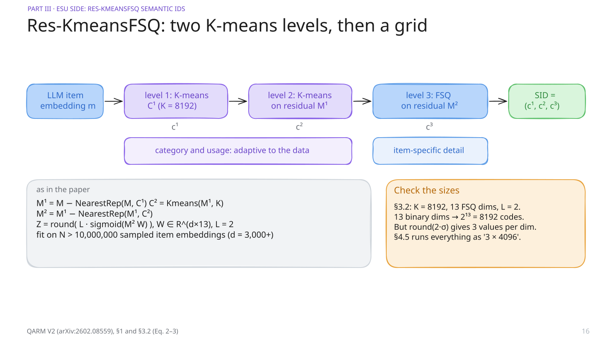

Terms: residual = what is left after subtracting the nearest centroid. c1, c2, c3 = the three levels of the semantic ID. FSQ formula: project, sigmoid, scale by L, round.

Say: Top row, left to right. Start from the LLM embedding m.

Level 1: K-means picks the nearest of K = 8,192 centroids; that index is c1, roughly the category.

Level 2: subtract that centroid to get the residual, and run K-means again; that gives c2, a finer category or usage.

Level 3: on the second residual use FSQ instead of K-means; that gives c3, the item-specific detail.

The semantic ID is (c1, c2, c3). The first two levels adapt to the data; the last spreads items evenly to avoid collisions.

Point to the orange box: the codebook sizes are inconsistent: 8,192 in the method section, "3 × 4096" in the experiments, and the FSQ formula as written gives three values per dimension. Mention it briefly.

Bridge: The next slide walks through the three rounds one by one.

## 17. sid rounds

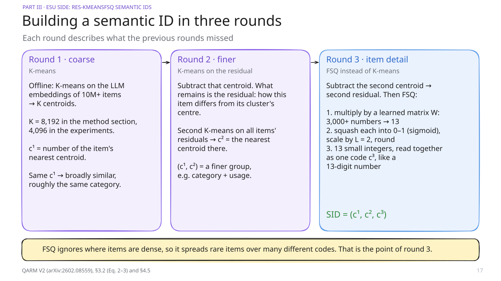

Terms: centroid = the centre of a K-means cluster. Residual = embedding minus its nearest centroid. FSQ = Finite Scalar Quantization. c1, c2, c3 = the three parts of the semantic ID.

Say: The previous slide in slow motion. Three rounds, each one describes what the earlier rounds missed.

Round 1, coarse: offline, K-means on the LLM embeddings of more than 10 million items gives K centroids. For an item, c1 is the number of its nearest centroid. Items with the same c1 are broadly similar, roughly the same category.

Round 2, finer: subtract that centroid. The residual is how this item differs from its cluster's centre. A second K-means on all residuals gives c2. Now (c1, c2) is a finer group, like category plus usage.

Round 3, item detail: subtract the second centroid and use FSQ instead of a third K-means. Multiply by a learned matrix W down to 13 numbers, squash each into 0 to 1 with a sigmoid, scale by L = 2 and round. The 13 small integers together are the code c3, like a 13-digit number.

Point to the yellow line: FSQ ignores where items are dense, so rare items spread over many codes. That is why round 3 is FSQ.

If asked: the paper does not say how W is trained, and with L = 2 the rounding gives three values per dimension, not two.

Bridge: How do the LLM embedding and the semantic IDs enter the ranker?

## 18. usage

Terms: inner product = similarity score between two embeddings. PCA = shrinks the embeddings for storage. Lookup embedding table = one trainable vector per code. Multi-task BCE = the usual click/purchase loss.

Say: Left, the GSU uses the LLM embedding. Every item's embedding is stored, PCA-reduced. For a target item, keep the top-k history items with the highest inner product with the target's embedding. Plain vector search, nothing trained.

Right, the ESU uses the semantic IDs. Each item is its ItemID plus c1, c2, c3, each looked up in its own trainable embedding table. Target attention: the target is the query, the top-k history items are keys and values. An MoE predicts CTR, CVR and so on, trained with multi-task BCE.

The point: the LLM embedding stays frozen in the GSU, but the semantic ID embeddings are learned end-to-end in the ESU. That is the fix for representation unlearning.

Bridge: Part IV, results. First, the only public dataset.

## 19. amazon

Terms: AUC. DIN, SIM-hard, SIM-soft = baselines (glossary slide). ESU retrieval of top-50.

Say: Amazon Book is the only public benchmark. QARM V2 reaches 70.33 AUC; the best baseline, SIM-soft, 69.57.

Point to the y-axis: it starts at 66, so the bars exaggerate. The gap is 0.76 AUC points.

Point to the setup box: the baselines are from 2018 and 2020. No TWIN, and no semantic-ID models like TIGER or OneRec.

Bridge: Kuaishou's own data, where the big claims are.

## 20. offline

Terms: GAUC gain in points over the production model. CTR, CVR, CTCVR (click and buy). WUAUC for Shopping#2 CTR.

Say: Each bar is one task: ads, three shopping services, four live-streaming tasks. Height = GAUC gain over the production model.

All twelve are positive; most between +0.1 and +0.5, ads CTCVR the largest at +1.1.

Point to the dashed line: the authors say about 0.1 GAUC is enough for business gains, which is normal in industry.

Caveat: no error bars, so we cannot tell how stable the small gains are.

Bridge: Offline is one thing. What happened with real users?

## 21. online ads shop

Terms: online A/B test, exposure, cost (ad spend), revenue, GMV, order.

Say: Live A/B tests over several weeks on main traffic.

Advertising: revenue +4.873% with cost +3.942%, so revenue grew faster than spend. Exposure +1.3%.

Shopping: GMV +1.0% to +5.6%; Shopping#2 gained most on GMV, orders and exposure.

For a platform this size that is a lot of money, but there are no confidence intervals or traffic sizes.

Bridge: Live streaming shows where the gains come from.

## 22. online live

Terms: cold-start streams vs others. Core metrics (click, watch time, gift count) vs interaction metrics (like, comment, follow).

Say: Live streaming, split into cold-start streams and the rest.

Point to the first row: in Live-streaming#1, cold-start click +3.231% versus +0.611% for other streams, about five times more. That is the paper's story: LLM content knowledge helps most where there is no interaction history.

Curiosity: gift count is exactly +2.917% in both "others" rows; a coincidence or a copy error.

Bridge: Did reasoning item alignment really improve the LLM embedding? The paper tests that directly.

## 23. alignment hr

Terms: item-to-item retrieval with the LLM embedding. Trigger items = the user's last 10 clicks. HR@200 / HR@500 = hit rate in the top 200 / 500 retrieved.

Say: The test: for each user take the 10 most recent clicked trigger items, retrieve 50 candidates per trigger with the LLM embedding, and count how often a real click or order is among them.

Gray is QARM, blue is QARM V2. Every hit rate goes up by roughly 60 to 77% relative; click HR@200 from 7.77% to 12.5%.

Point to the orange text: an inconsistency. The text says order HR@500 rose from 20.0%, the table says 13.0%.

Bridge: And did the semantic IDs stop colliding?

## 24. code conflict

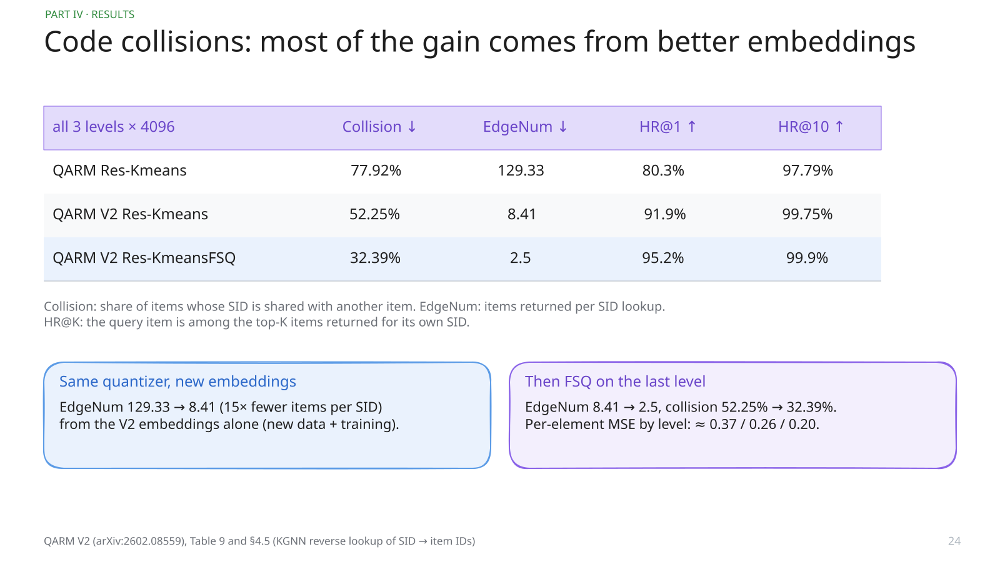

Terms: Collision = share of items whose semantic ID is shared. EdgeNum = items returned per semantic-ID lookup. HR@1 = the item itself comes back first. KGNN = Kuaishou's graph store used for the lookup.

Say: Three rows, top to bottom.

QARM Res-Kmeans: collision 77.92%, EdgeNum 129.

QARM V2 Res-Kmeans: same quantizer, new V2 LLM embeddings. EdgeNum drops to 8.4, 15 times fewer, from better embeddings alone.

QARM V2 Res-KmeansFSQ: FSQ on the last level. EdgeNum 2.5, collision 32.39%, HR@1 95.2%.

Point to the two boxes: most of the improvement comes from better embeddings, not from FSQ.

Bridge: One qualitative check of the GSU.

## 25. gsu case

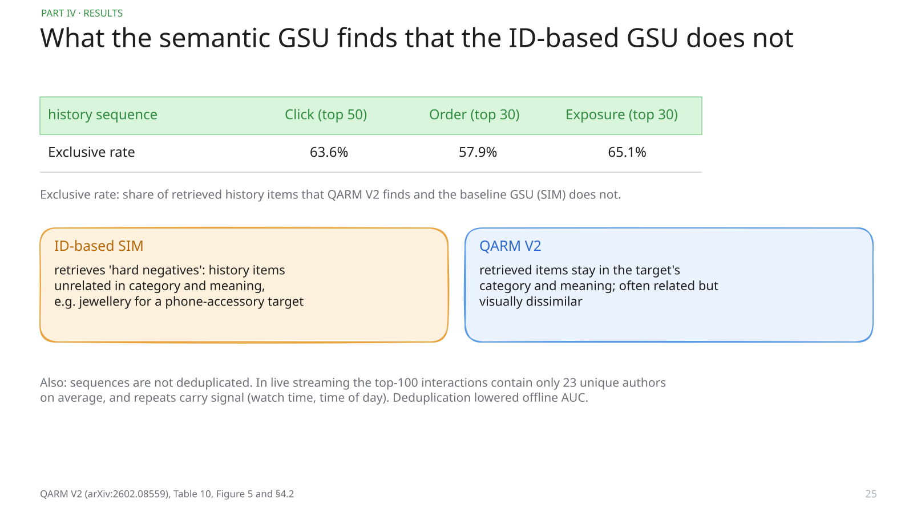

Terms: exclusive rate = share of history items the QARM V2 GSU retrieves that the ID-based SIM GSU does not. Hard negatives = retrieved items that are actually unrelated. Deduplication = removing repeated items from the sequence.

Say: About 60% of what the new GSU retrieves is exclusive: the ID-based SIM GSU would not have retrieved it.

Point to the boxes: in the paper's examples, SIM retrieves hard negatives, like jewellery for a phone-accessory target; QARM V2 stays in the right category and meaning.

Point to the bottom: they do not deduplicate sequences. In live streaming the top-100 interactions cover only 23 authors on average, and the repeats carry signal; deduplication lowered offline AUC.

Bridge: Part V. Time to be critical.

## 26. critique

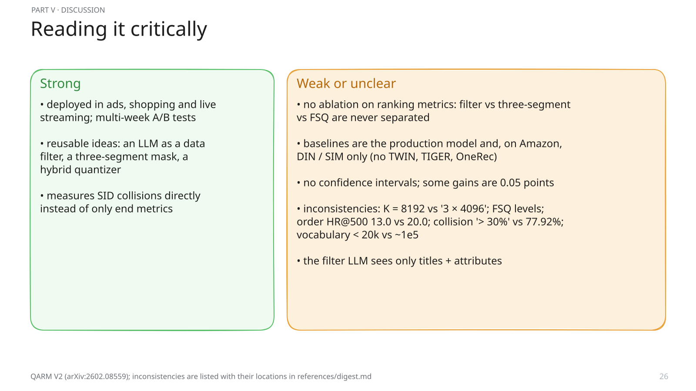

Terms: ablation = removing one component to measure its effect.

Say: Strong: deployed in ads, shopping and live streaming with multi-week A/B tests; reusable ideas (an LLM as a data filter, the three-segment mask, the hybrid quantizer); and SID collisions measured directly.

Weak: four changes at once and no ablation on ranking metrics; old public baselines; no confidence intervals; numbers that disagree between text and tables; and the filtering LLM sees only titles and attributes, not images.

Bridge: To close, five takeaways.

## 27. takeaways

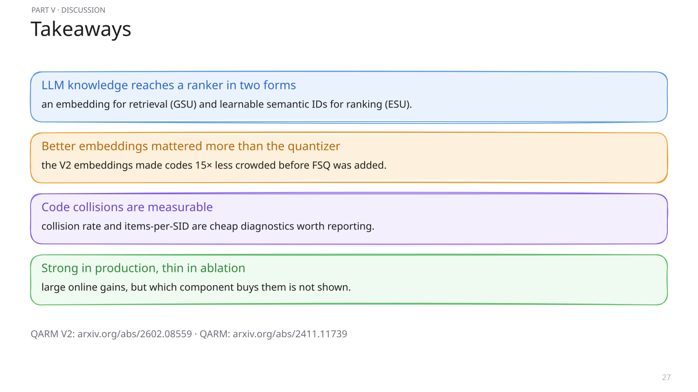

Terms: as on earlier slides.

Say: Five things to take home, each with its evidence.

One: a frozen LLM embedding is not enough. QARM showed it: the same knowledge gave +0.02 AUC as a frozen feature and +0.18 as learnable semantic IDs.

Two: align the LLM to business similarity, and clean the alignment pairs first. The reasoning LLM throws out more than 70% of the User2Item pairs, and retrieval with the LLM embedding gets much better: click HR@200 from 7.77% to 12.5%.

Three: the three-segment mask lets one LLM produce an embedding and still do next-token prediction, because the QA tokens can only see the <EMB> tokens.

Four: K-means for the coarse levels, FSQ for the last level cuts SID collisions from 78% to 32%. But note that better embeddings alone already did most of it.

Five: the gains are largest where ID embeddings are weakest, on cold-start items: five times more click gain for new live streams.

Point to the bottom line: the open question is which of the four changes buys the online gains; there is no ablation. Good place to open the discussion.

Thank you. Questions?

