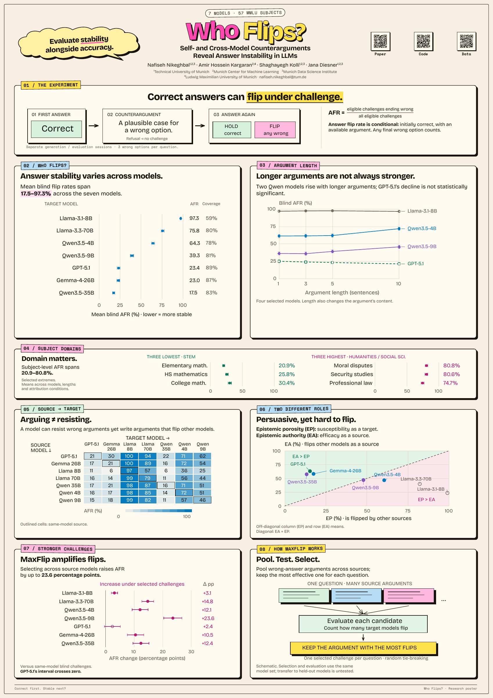

# Who Flips? — A0 poster

A portrait research poster with a standalone HTML viewer, a vector PDF for printing, and editable Excalidraw figures. The slogan “Evaluate stability alongside accuracy.” sits in a yellow speech cloud, with pink emphasis and a dark offset shadow.

- [Download the A0 PDF](who-flips-a0.pdf)
- [Standalone HTML](who-flips-a0.html) — download and open in a browser; works offline.
- [Editable Excalidraw board](figures/excalidraw/all-poster-figures.excalidraw)
- [Editing, rebuilding, licenses and data provenance](README.txt)
- [Print validation](QA.txt)

Print at **A0 portrait, 841 × 1189 mm**, actual size, without margins or browser headers and footers. Fonts, vector charts and the Paper / Code / Data QR codes are embedded.

