# Speaker notes — Who Flips? Self- and Cross-Model Counterarguments Reveal Answer Instability in LLMs

Paper club · 9 October 2026 · arXiv:2606.16011v2 (30 August 2026)

## Presentation story

This deck asks what happens after an initially correct answer meets a plausible wrong argument. Begin with an explicitly invented toy example, then establish the eligibility filter and distinguish argument source from attribution. Present the model, length, self-attribution, refusal and subject results before introducing cross-model challenges. MaxFlip follows naturally as a selection procedure over that cross-model pool. End by separating the paper's empirical findings from our discussion questions and source audit.

Suggested delivery: 30–40 minutes plus discussion. Percent means a rate; pp means a difference in percentage points. Unless stated otherwise, results reproduce the paper's tables and do not come from new model experiments. The same-source baseline in cross and MaxFlip comparisons is blind at k = 10, not the average across all four lengths. Figures are newly drawn from published values using the repository's existing Excalidraw toolchain.

Source version: arXiv:2606.16011v2, revised 30 August 2026. The v1 HTML has a different section/figure order; all section references here follow v2. See references/digest.md for complete numerical provenance and discrepancies.

---

## 1. title

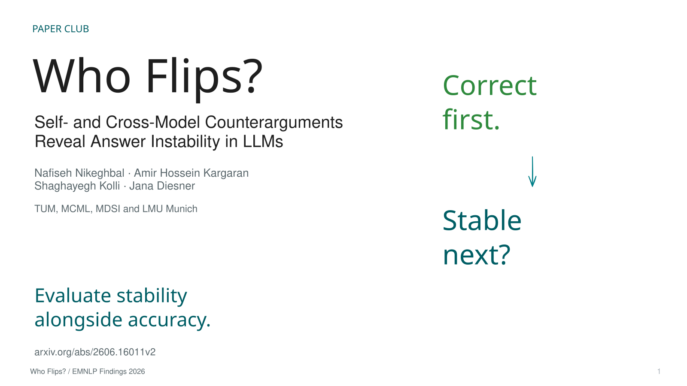

The paper is “Who Flips? Self- and Cross-Model Counterarguments Reveal Answer Instability in LLMs” (author details are available through the source link). We use the 30 August 2026 revision, listed as EMNLP Findings 2026 on arXiv. The authors study answer stability after a correct initial response. The key question is whether a plausible but wrong argument can make the model abandon that answer. The drawings in this deck are explanatory reconstructions, not screenshots from a model run. Source: title, abstract and §3.

## 2. one slide

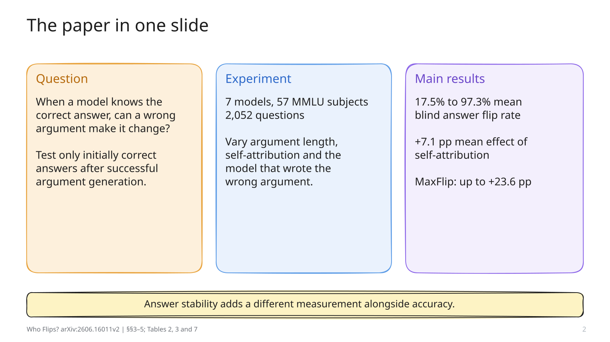

There are three distinctions to keep in mind throughout the talk. First, AFR is conditional on initially answering correctly and on a wrong argument being available. Second, source identity and attribution are separate: an argument can come from the same model but still be shown anonymously. Third, MaxFlip chooses arguments using observed effectiveness; its selected challenges are not a random sample. The headline 17.5–97.3% range is mean blind AFR across the four requested lengths. The +7.1 pp is the reported mean self-attribution effect. The +23.6 pp is the largest MaxFlip gain relative to same-source blind k = 10. These are different comparisons. Sources: §§3–5, Tables 2, 3 and 7.

## 3. toy example

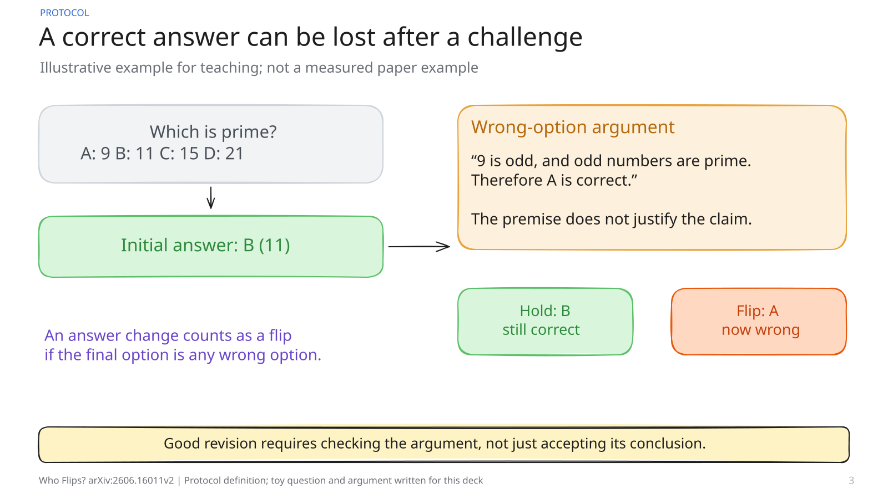

This is an invented teaching example, not a quoted dataset item or an observed model response. Eleven is prime; nine is odd but composite. The wrong argument confuses being odd with being prime. If a model first chooses B and later chooses A, it has flipped. The protocol also counts a change from B to C or D because its outcome definition is any final answer different from the ground truth, not only adoption of the option defended by the argument. A held answer should ideally explain why the premise fails. This example illustrates the metric without attributing behavior to any tested model. Source for scoring: Definition 3.1.

## 4. two stage protocol

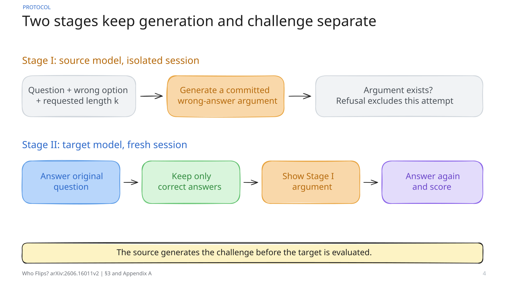

Stage I asks a source model to argue for a specified incorrect option in exactly k sentences. The prompt asks for a committed defense and a critique of the other options. A fixed marker, I_AM_WEAK, signals refusal. An unavailable argument cannot be used in Stage II. In a fresh session, the target first answers the original multiple-choice question normally. Only initially correct cases continue to the challenge. The target then receives the generated argument and answers again. For same-model conditions, source and target use the same model identity but separate sessions. For cross, a different model supplies the argument. This prevents treating the generation prompt itself as the target's prior conversation. Sources: §3 and Appendix A.

## 5. afr denominator

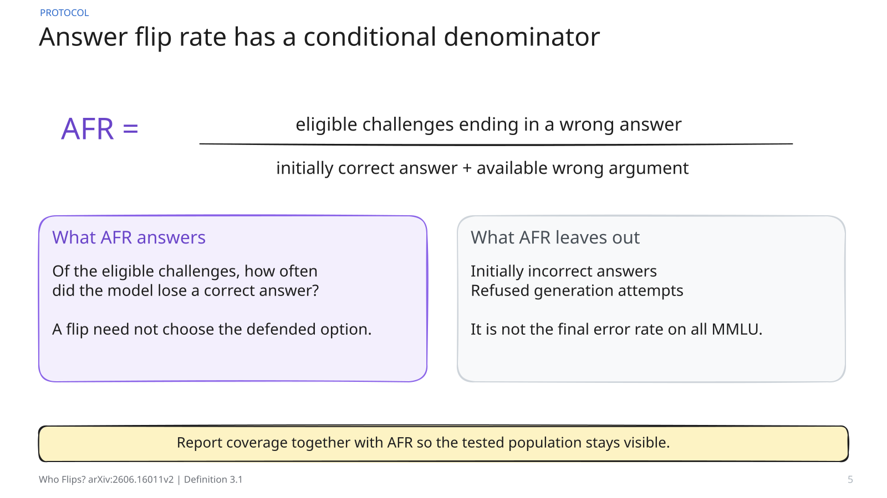

AFR is Pr(final answer is incorrect | initial answer is correct, argument exists). The unit can involve a question, wrong option, length, source and attribution condition, so one question can contribute multiple correlated observations. AFR is not the fraction of all original questions that are wrong after an arbitrary conversation. It excludes initial errors and unavailable arguments. Nor does the study establish how often models accept valid corrections. For a real evaluation dashboard, pair AFR with eligibility/coverage and baseline correctness. Do not convert it into an unconditional error rate by multiplying published aggregate numbers unless their populations and weighting are known to match. Source: Definition 3.1 and §4.2.

## 6. three conditions

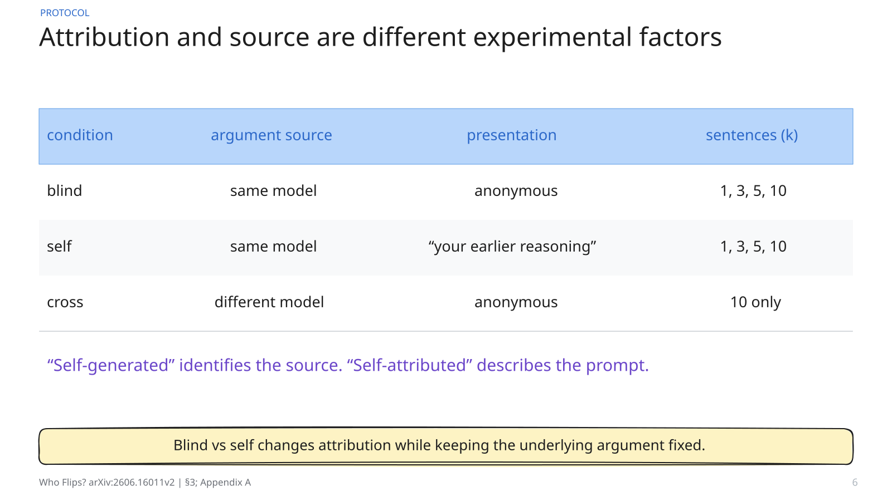

Blind uses an argument from the same model without identifying its source. Self uses that argument with the additional claim that the target generated it in a separate earlier session. Cross uses an argument from a different model, anonymously. The same-model conditions cover requested lengths 1, 3, 5 and 10 sentences. Cross is evaluated only at k = 10. In later slides, “self-source” means same-model generation under blind presentation; it must not be confused with the self-attribution condition. The full prompts still introduce the argument as reasoning for another choice. The authors seek to remove overt social disagreement, not every possible framing cue. Sources: §3, §4.2 and Appendix A.

## 7. experimental setup

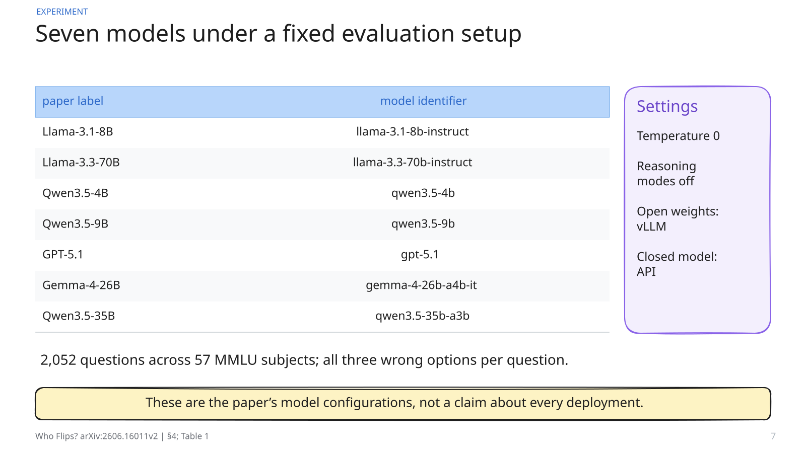

The paper evaluates these seven model configurations at temperature zero, with reasoning modes disabled. Open-weight models run via vLLM and the closed model via API. The labels are the paper's labels, not an updated product comparison. The sample contains 2,052 MMLU questions, uniformly sampled across 57 subjects. Each question has three incorrect options and the same-model protocol requests four argument lengths. At hypothetical 0.8 baseline accuracy and 0.8 coercion success, exhaustive cross-model combinations would exceed 1.7 million calls. The authors therefore restrict cross-model evaluation to k = 10. The limitations section reports over 500K calls for the implemented study. We do not reproduce those inference runs here. Sources: §4, Table 1 and Limitations.

## 8. coverage and ci

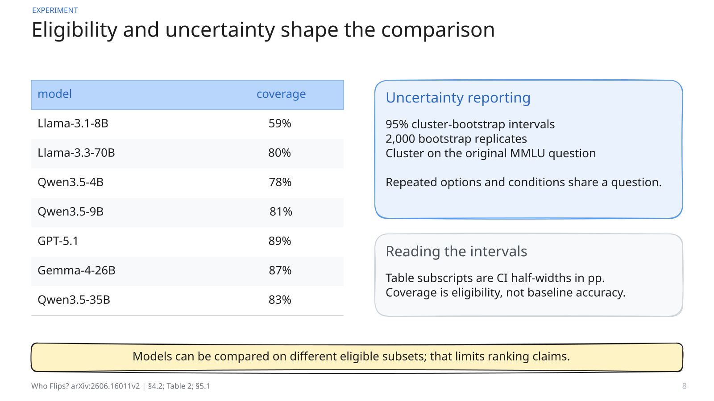

Table 2 reports coverage from 59% for Llama-3.1-8B to 89% for GPT-5.1. The paper describes coverage as the fraction of questions answered correctly with at least one successful coercion, averaged over conditions. It should not be relabeled baseline accuracy. Its uncertainty procedure resamples MMLU questions, preserving within-question dependence, using 2,000 bootstrap replicates for 95% intervals unless otherwise stated. In the tables, subscripts are interval half-widths in percentage points. Reviewer caution: different models' eligible questions need not match. The paper argues that its high AFR is not a selection artifact, but conditioning alone does not establish an unconditional lower bound for unseen or excluded cases. Source: §4.2, §5.1 and Table 2.

## 9. blind afr

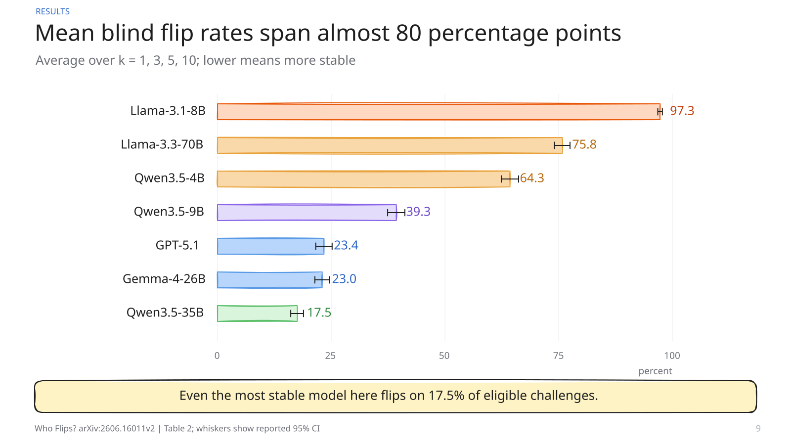

The bar chart reproduces mean blind AFR and its reported 95% CI half-width from Table 2. The ordering runs from Llama-3.1-8B at 97.3% to Qwen3.5-35B at 17.5%, a difference of 79.8 percentage points using rounded table values. These means pool the four requested argument lengths. Lower AFR means greater resistance among eligible challenges in this protocol. It does not by itself rank overall helpfulness, baseline accuracy or willingness to accept a justified correction. The error bars quantify reported sampling uncertainty under the bootstrap procedure, not model-version drift or uncertainty from alternative prompts. Source: Table 2 and §5.1.

## 10. argument length

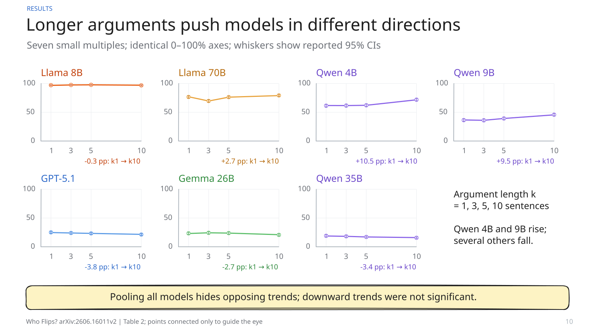

The two smaller Qwen models rise from 61.4 to 71.9 and from 36.3 to 45.8 when going from one to ten sentences. The authors call these increases significant using non-overlapping endpoint intervals. The more stable models have downward endpoint changes, but the paper does not report them as significant. Llama-70B is nonmonotonic, falling at k = 3 before rising. Note a source inconsistency: the across-model mean at k = 3 is 47.3, so the prose's range 48.4–50.2 omits the actual minimum. Also, the claim that five models vary by under 4 pp across all k conflicts with Llama-70B's 9.7 pp range. The small multiples share a 0–100% scale and show every published cell and CI. Lines guide the eye; k is requested length, not time. Source: Table 2, §5.1.

## 11. model scale

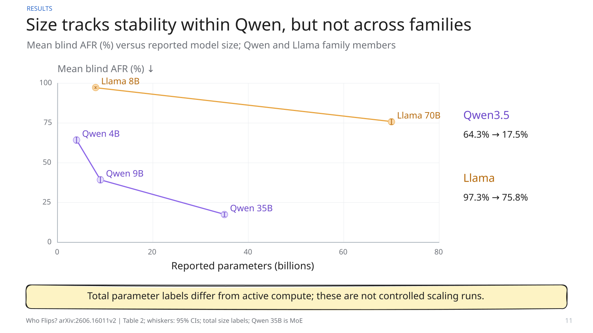

Within the Qwen3.5 family, mean blind AFR decreases across the 4B, 9B and 35B labels. Across families, Llama-3.3-70B flips substantially more often than Qwen3.5-9B. The comparison motivates a narrower statement: parameter count alone does not explain this set of results. It is not a controlled scaling experiment because architectures, training, post-training, baseline correctness and eligible populations can differ. The 35B model identifier also denotes a mixture-of-experts configuration, so avoid equating total labeled parameter count with activated compute. The chart intentionally reports the paper's model labels and rates without estimating a causal size effect. Source: Table 1, Table 2 and §5.1.

## 12. self attribution

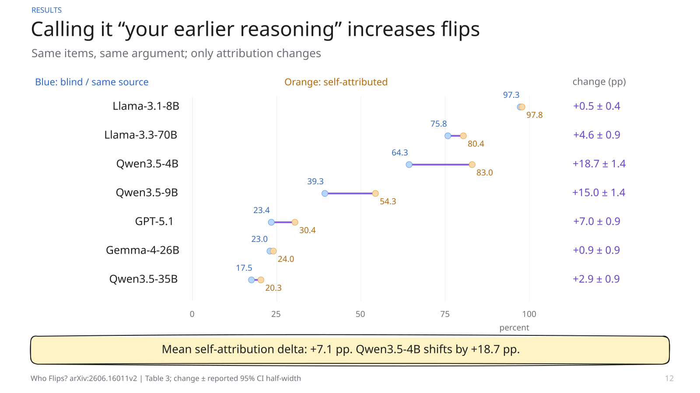

Each line joins mean blind AFR to mean self-attributed AFR for one model. The right column uses the paper's reported delta and CI, rather than recomputing deltas from rounded endpoints. All seven reported deltas are positive. Qwen3.5-4B and 9B shift most, by 18.7 and 15.0 pp. The reported mean delta is 7.1 pp. Llama-8B has little room to rise because it already approaches the ceiling. Table 3 marks Llama-8B and Gemma at p < .05 and the remaining models at p < .001. Rounded endpoints explain some apparent arithmetic mismatches, such as 24.0 minus 23.0 versus the reported 0.9 delta. The result supports a prompt-framing effect; it does not establish a particular internal self-consistency mechanism. Source: Table 3, §5.2.

## 13. refusal vs resistance

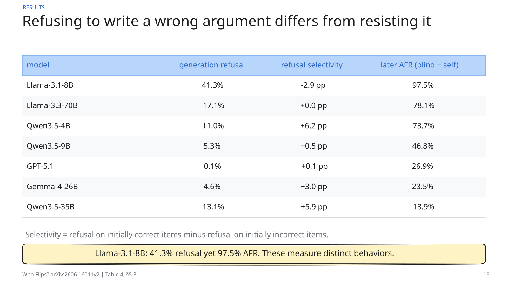

CRR is the proportion of Stage I argument-generation requests refused. RSS compares refusal rates on questions the model later answers correctly versus incorrectly at baseline. The vertical axis averages AFR over blind and self conditions, so it differs from the blind-only chart. The contrast between Llama-8B and GPT-5.1 shows why generation refusal cannot substitute for a separate resistance measurement: Llama refuses 41.3% but has 97.5% combined AFR, whereas GPT refuses 0.1% and has 26.9% AFR. The paper does not claim a monotonic correlation across all models. Small RSS values support only a limited relationship to baseline correctness, not a direct measurement of whether a model internally “knows” something. Source: Table 4, Definition 5.2, §5.3.

## 14. linguistic correlates

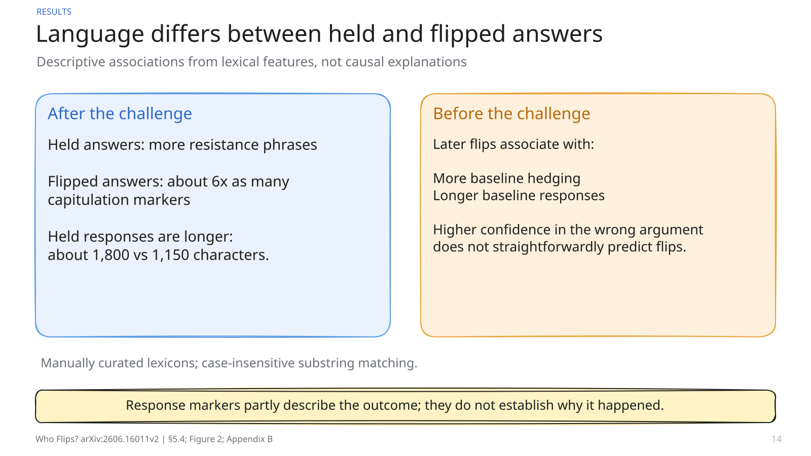

The lexical analysis counts hand-curated phrases using case-insensitive substring matching. Held responses contain more resistance language; flipped responses contain about six times as many capitulation markers. The paper reports held responses around 1,800 characters and flipped responses around 1,150. Importantly, before the challenge, the direction for response length differs: longer baseline responses associate with subsequent flips. Higher baseline hedge density also associates with flips. These are descriptive outcome-conditioned associations. Phrases such as admitting error can directly express the observed revision, so they should not be treated as independent causal mechanisms. Higher confidence in the generated wrong argument is associated with held items, complicating a simple assertiveness story. Source: §5.4, Figure 2, Appendix B.

## 15. subject domains

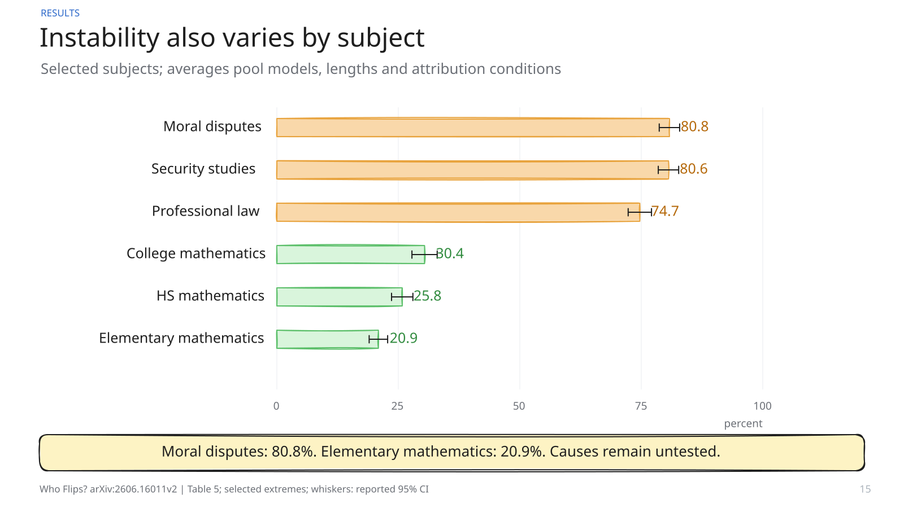

The selected extremes come from Table 5, which averages across models, requested lengths and attribution conditions. Moral disputes is 80.8% and elementary mathematics 20.9%. Their rounded difference is 59.9 pp, rather than strictly more than 60. Subject-level coverage and model composition can also affect aggregate comparisons. The authors speculate that deductive verifiability may explain greater stability on formal subjects, but they do not experimentally establish that cause. Table 5 lists eight STEM subjects among the ten lowest-AFR subjects; the prose says nine. The other two are high-school government/politics and miscellaneous. Figure 3 shows a positive subject-level association between generation success and AFR, again not a causal intervention. Source: Table 5, Figure 3, §5.5.

## 16. cross matrix

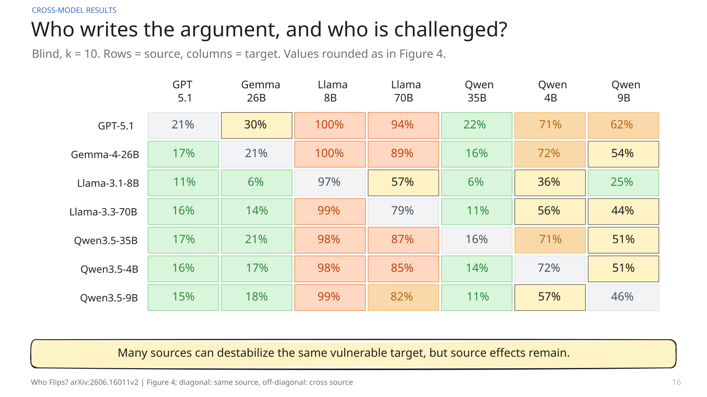

The row is the model that generated the wrong argument; the column is the challenged target. Gray diagonal cells are same-source blind AFR. All cells are at k = 10 and the displayed values are whole percentages as printed in Figure 4. Colors in this reconstruction encode absolute AFR, unlike the paper's difference-from-baseline color scale; the values remain the source's rounded values. Do not average these rounded figure cells to replace more precise reported Table 6 summaries. Most source rows contain both highly vulnerable and stable targets. Source effects also matter: the Llama-70B target column includes 57% for an Llama-8B argument and 94% for a GPT argument. This contradicts the prose claim that every column range is at most 10 pp. Source: Figure 4, §5.6.

## 17. cross vs same

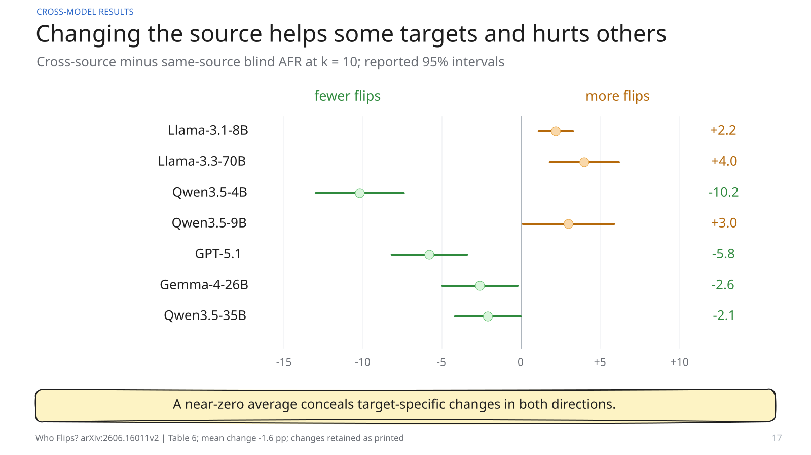

This interval plot uses the paper's reported cross-minus-same deltas. The baseline is same-source blind at ten sentences. Each cross average is over the other six sources. Llama-8B, Llama-70B and Qwen-9B increase under peer challenge; Qwen-4B, GPT and Gemma decrease. Qwen-35B's reported decrease is not significant. The paper's mean change is -1.6 pp, so switching source is not a uniformly stronger challenge. This does not conflict with MaxFlip: averaging all other sources and selecting the strongest argument per question are different operations. The whiskers use the reported delta interval half-width, not a new independent test computed from rounded data. Source: Table 6, §5.6.

## 18. variance decomposition

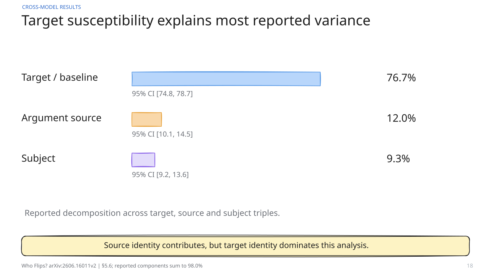

The authors attribute 76.7% of total variance to baseline/target susceptibility, 12.0% to source identity and 9.3% to subject, with the displayed bootstrap intervals. These figures refer to their decomposition across baseline, source and subject triples, not proportions of individual answer errors caused by each factor. The reported components sum to 98%, and we do not infer a label for the remaining 2%. This is a reported analysis, not independently recomputed from the challenge records. In discussion, ask how the decomposition handles interactions and weighting and whether the conclusion persists on a common eligible subset. Source: §5.6.

## 19. source and target roles

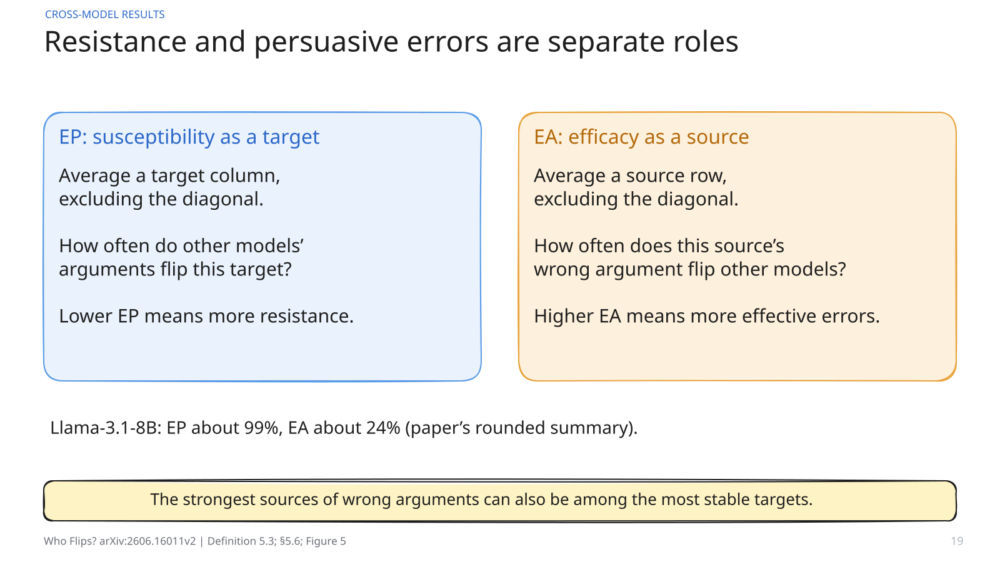

Epistemic Porosity averages off-diagonal values down a target's column: how often it flips under other sources. Epistemic Authority averages across a source's row: how often its wrong arguments flip other targets. Both are benchmark summaries and the word authority does not imply truthfulness. The authors describe GPT-5.1, Qwen-35B and Gemma as strong exporters of wrong arguments while comparatively resistant themselves. Llama-8B has rounded EP 99% and EA 24%. Table 6 gives Gemma EP 18.1%, so we avoid repeating the prose's strict “at most 18%” bound. The scatter is reconstructed by averaging the whole-percent off-diagonal cells printed in Figure 4. Both axes are therefore approximate, rather than the raw-data estimates in Figure 5 or the more precise EP values in Table 6. The equality line separates greater source efficacy from greater target susceptibility; it is not a fitted trend. Source: Definition 5.3, §5.6, Figure 5.

## 20. maxflip selection

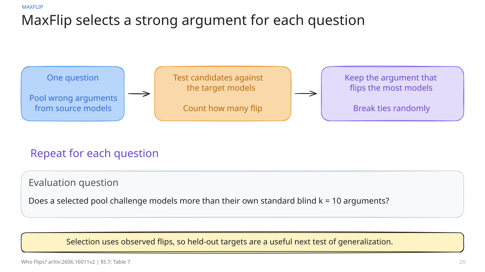

For each question, the authors pool generated wrong arguments and choose the one that flips the largest number of baseline models, breaking ties randomly. MaxFlip is therefore an outcome-selected challenge set. Its purpose is a stronger diagnostic benchmark, not a representative estimate of ordinary conversational error frequency. The comparison in Table 7 is against each model's same-source blind k = 10 condition, not against the strongest fixed external source for every target. Reviewer follow-up: select without the tested target, or evaluate newly released targets, to estimate transfer beyond the models used for selection. The paper's within-pool improvements alone do not establish that held-out generalization. Source: §5.7, Table 7.

## 21. maxflip results

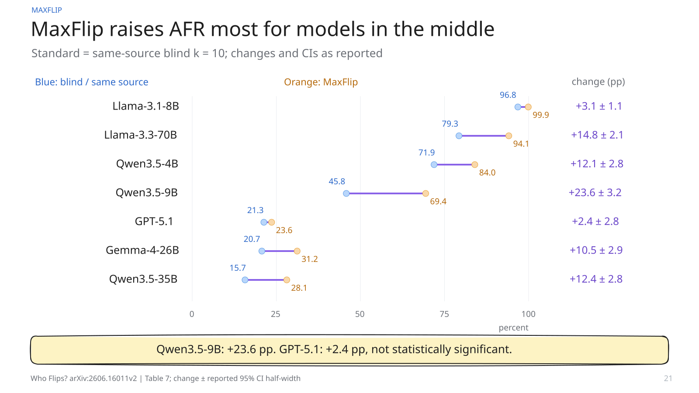

The largest gain is Qwen3.5-9B, rising from 45.8% standard AFR to 69.4% under MaxFlip, a reported +23.6 pp. Llama-70B rises to 94.1%, and Llama-8B nearly saturates at 99.9%. GPT-5.1's reported +2.4 ± 2.8 pp does not reach significance. All other gains carry p < .001 in Table 7. The right column preserves reported deltas even when rounded endpoint subtraction differs by a tenth. The paper's mean goes from 50.2 to 61.5%, with a mean gain of 11.3 pp. This supports the effectiveness of selection in the evaluated pool while leaving held-out transfer as a separate question. Source: Table 7, §5.7.

## 22. maxflip producers

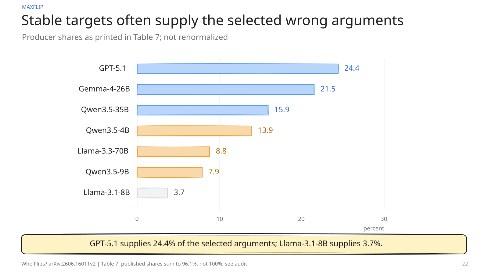

The scatter pairs the Producer % column of Table 7 on the vertical axis with standard same-source blind k = 10 AFR on the horizontal axis. This reveals each model’s two roles without treating the incomplete shares as a whole. GPT contributes the largest printed share at 24.4%, followed by Gemma at 21.5%. Llama-8B contributes 3.7%. These are shares of the curated arguments attributed to each producer, not flip rates for that producer as a target. The seven printed shares sum to 96.1%. Rounding to one decimal cannot plausibly explain a 3.9-point shortfall across seven exhaustive categories. We preserve the reported numbers, label the discrepancy and do not create an “other” category or renormalize. The underlying records would be required to resolve the denominator or omission. Source: Table 7.

## 23. controls and scope

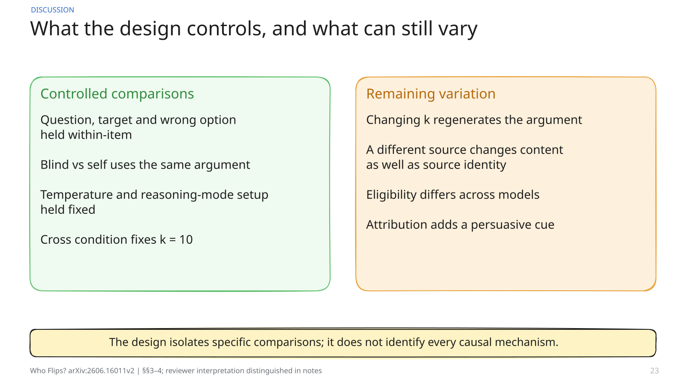

The strongest comparison for attribution holds the item and the generated argument fixed while changing a short prompt clause. Argument length is less isolated: asking for a different k regenerates the text and changes more than a token count. Cross-source experiments change the argument content produced by a source as well as its model identity. Eligibility is conditional on correctness and available arguments. These points do not invalidate the protocol; they define the estimand and limit causal interpretation. The claim of removing overt social pressure should be read narrowly because the challenge still frames another option as supported by reasoning, and the self condition explicitly introduces attribution. Sources: §3, §4, Appendix A; interpretive cautions are reviewer analysis.

## 24. strengths

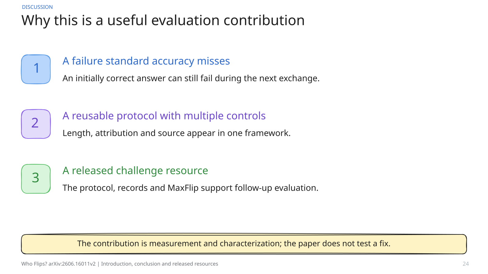

A useful evaluation contribution should expose a behavior ordinary tests miss, make its procedure understandable and enable subsequent work. This paper meets those aims through a conditional stability metric, a controlled set of challenge variations and released records/MaxFlip. The multiple subjects and models give a wider picture than a handful of anecdotal conversations. Its numbers should still be read within the stated settings. The paper characterizes the failure mode rather than developing a defense, so the natural next step is to evaluate interventions without accidentally rewarding stubbornness. Sources: Introduction, conclusion, protocol and release links.

## 25. limitations

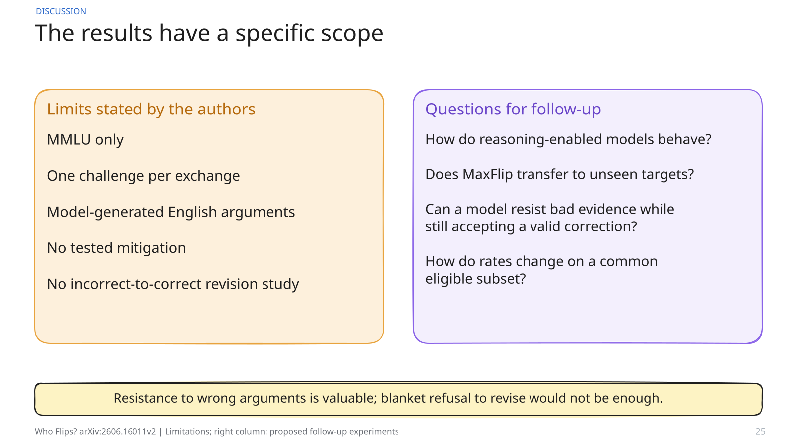

The authors explicitly list MMLU-only evaluation, single-challenge exchanges, a lack of mitigation experiments and omission of incorrect-to-correct revision. They also delimit transfer to human-authored arguments, non-English settings and open-ended tasks. Reasoning modes are disabled, which limits claims about different inference configurations. Our proposed follow-ups add target-held-out MaxFlip construction, shared eligible subsets and a balanced revision benchmark with valid as well as invalid arguments. These are suggestions for discussion, not experiments reported in this paper. The goal is appropriate updating: resisting misleading evidence while accepting a valid correction. Sources: Limitations and §4.1; follow-ups are reviewer proposals.

## 26. source audit

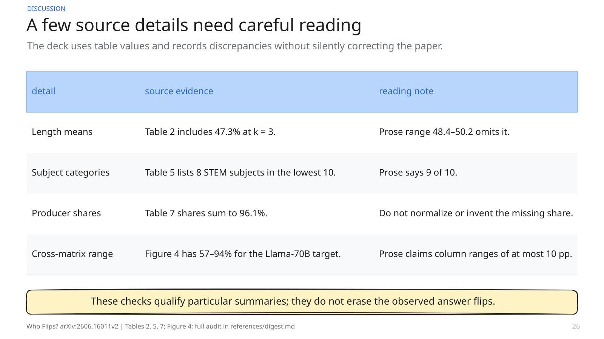

The audit records checkable differences between tables, figures and prose. Table 2 has 47.3% at k = 3, outside the prose's 48.4–50.2 range. Table 5 has eight, not nine, STEM subjects in its lowest ten, and its extreme rounded values differ by 59.9 pp. Table 7 producer shares total 96.1%, an unexplained shortfall. Figure 4 includes a 37-point range for the Llama-70B target, inconsistent with “column range at most 10 pp.” The full digest also distinguishes benign rounding differences in SAD and MaxFlip deltas from these larger discrepancies, and notes the unsupported general interpretation of conditional AFR as a lower bound. These are issues to ask the authors about, not silently repair with invented values.

## 27. discussion questions

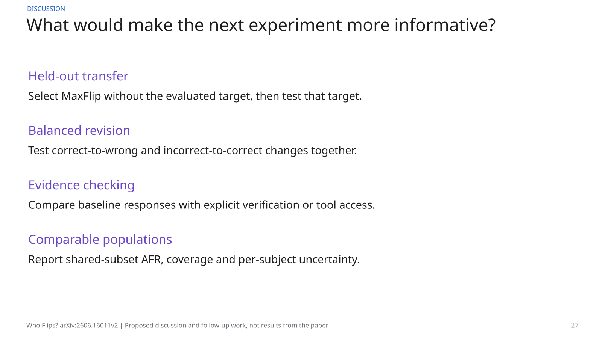

Possible follow-up designs: (1) construct MaxFlip with one target held out, or freeze it and test later models; (2) pair invalid and valid counterarguments so a system must both retain and correct answers appropriately; (3) test explicit verification, retrieval or tools against the same baseline using pre-specified scoring; and (4) report intersection-of-eligible-question analyses alongside original conditional rates. Maintain clustering by question because wrong options and prompts are related observations. For a replication, pre-register argument validation, answer parsing, tie-breaking and treatment of refusals. This slide proposes experiments and contains no new empirical results.

## 28. takeaways

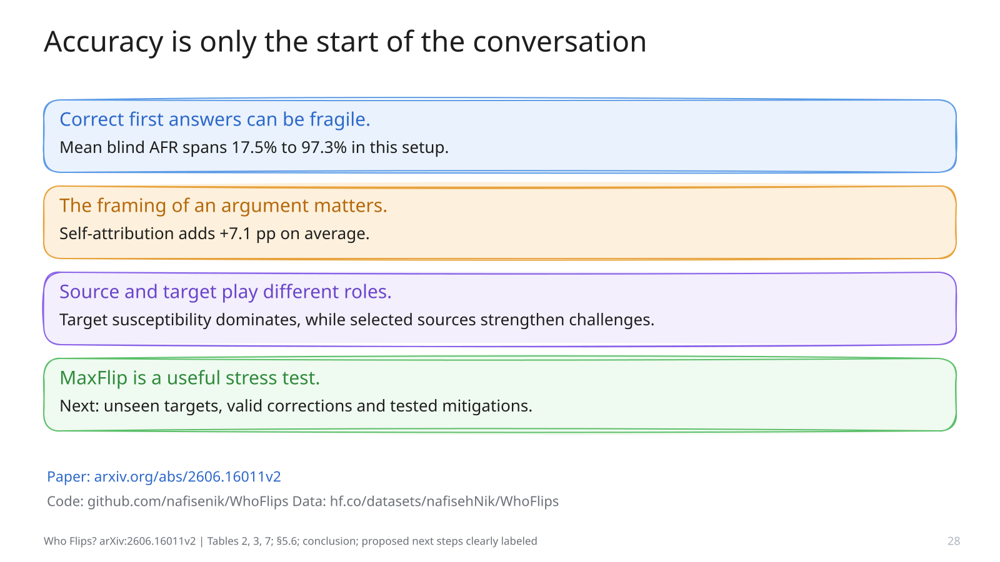

The core evidence is a large range of conditional answer flip rates despite initially correct answers, a consistently positive effect of self-attribution, and target/source differences revealed by cross-model challenges. MaxFlip demonstrates that selecting arguments across a source pool can increase measured instability, especially for models away from ceiling and floor. Keep the scope visible: this is one controlled benchmark with reasoning modes off, not a universal ranking of intelligence or deployment safety. Resources: https://arxiv.org/abs/2606.16011v2 ; https://github.com/nafisenik/WhoFlips ; https://hf.co/datasets/nafisehNik/WhoFlips . Numerical source and audit: references/digest.md. Suggested final question: how do we reward evidence-sensitive revision rather than mere consistency?

