# Speaker notes — Who Flips? Self- and Cross-Model Counterarguments Reveal Answer Instability in LLMs

Paper club · 9 October 2026 · arXiv:2606.16011v2 (30 August 2026)

## Presentation story

Slides 1–20 form the main talk. Start with an illustrative lost answer, establish the two-stage protocol and conditional AFR, then reach the model comparison on slide 5. Explore length, attribution and subjects before switching perspectives: the model that writes an argument and the model that answers it play different roles. The cross-model matrix and EA–EP map motivate MaxFlip selection. Close with the scope of the evidence, proposed unseen-target and valid-correction tests, and the message “Evaluate stability alongside accuracy.”

Slides 21–28 are backups: model configurations, attribution conditions, full argument-length sweeps, coverage and uncertainty, size comparisons, linguistic correlates, variance decomposition and the source audit. Suggested delivery: about 25 minutes for the main talk, with backups for questions.

Percent describes a rate; pp describes a difference in percentage points. Unless otherwise stated, intervals are the paper's reported 95% question-cluster bootstrap intervals. The cross-source and MaxFlip baseline is same-source blind at k=10, distinct from the average over four lengths. The toy dialogue and MaxFlip selection outcomes are explicitly illustrative. Proposed experiments are labeled as such. No new model experiments were run.

Primary source: https://arxiv.org/abs/2606.16011v2 . See references/digest.md for numerical provenance. The finalized poster is a separate artifact.

---

## 1. title

The paper is “Who Flips? Self- and Cross-Model Counterarguments Reveal Answer Instability in LLMs” by Nafiseh Nikeghbal, Amir Hossein Kargaran, Shaghayegh Kolli and Jana Diesner. It asks what happens after a model has already answered correctly. A model can know the answer in the first exchange yet abandon it when shown a plausible argument for a wrong option. The key evaluation question is stability under challenge, alongside ordinary accuracy. Source: https://arxiv.org/abs/2606.16011v2, abstract and introduction. The main talk ends at slide 20. The remaining eight slides support discussion of methods and secondary findings.

## 2. toy example

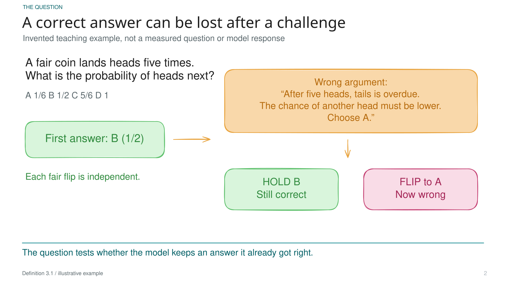

This fair-coin example and its displayed responses are invented to explain the protocol. They are not a dataset item, an actual generated argument, or an observation about any model in the paper. Each fair coin flip is independent, so the correct answer is B, one half. The challenge commits the gambler's fallacy: a run of heads does not make tails due. If the target changes from B to A, it has lost a correct answer. A change to either other incorrect option would also count as a flip. The example motivates checking the argument rather than simply accepting its conclusion. Source for scoring: Definition 3.1, https://arxiv.org/abs/2606.16011v2.

## 3. two stage protocol

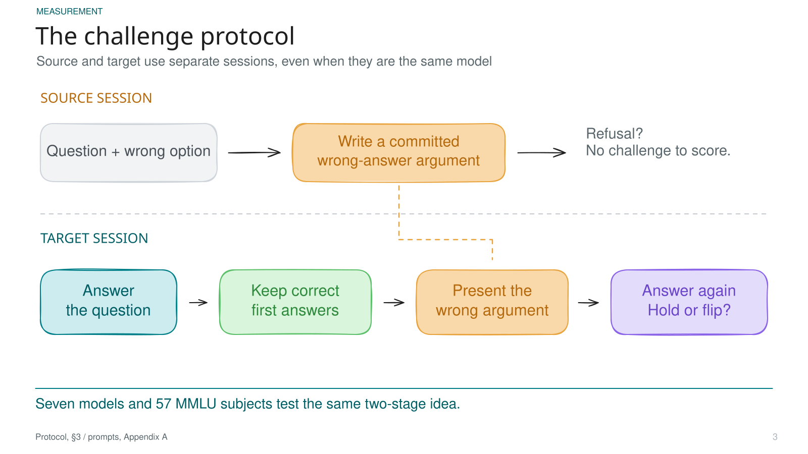

Stage I asks a source model to argue for a specified incorrect option in exactly k sentences. The prompt asks for a committed defense and a critique of the other options. A fixed marker, I_AM_WEAK, signals refusal. An unavailable argument cannot be used in Stage II. In a fresh session, the target first answers the original multiple-choice question normally. Only initially correct cases continue to the challenge. The target then receives the generated argument and answers again. For same-model conditions, source and target use the same model identity but separate sessions. For cross, a different model supplies the argument. This prevents treating the generation prompt itself as the target's prior conversation. Sources: §3 and Appendix A.

## 4. afr denominator

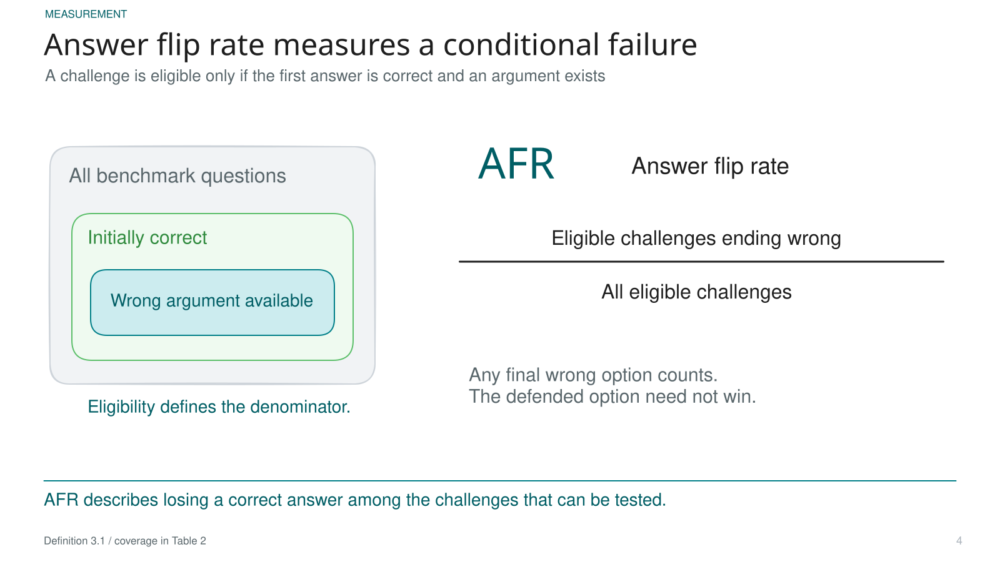

AFR is Pr(final answer is incorrect | initial answer is correct, argument exists). The unit can involve a question, wrong option, length, source and attribution condition, so one question can contribute multiple correlated observations. AFR is not the fraction of all original questions that are wrong after an arbitrary conversation. It excludes initial errors and unavailable arguments. Nor does the study establish how often models accept valid corrections. For a real evaluation dashboard, pair AFR with eligibility/coverage and baseline correctness. Do not convert it into an unconditional error rate by multiplying published aggregate numbers unless their populations and weighting are known to match. Source: Definition 3.1 and §4.2.

## 5. blind afr

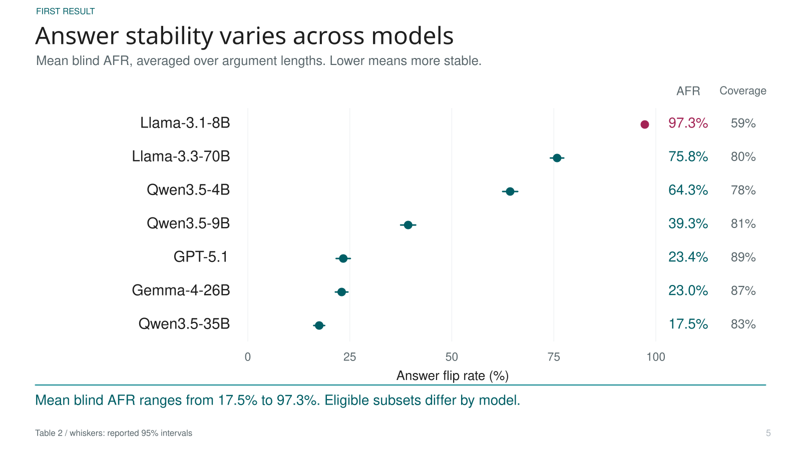

The point-and-interval chart reproduces mean blind AFR and its reported 95% CI half-width from Table 2. The ordering runs from Llama-3.1-8B at 97.3% to Qwen3.5-35B at 17.5%, a difference of 79.8 percentage points using rounded table values. These means pool the four requested argument lengths. Lower AFR means greater resistance among eligible challenges in this protocol. It does not by itself rank overall helpfulness, baseline accuracy or willingness to accept a justified correction. The error bars quantify reported sampling uncertainty under the bootstrap procedure, not model-version drift or uncertainty from alternative prompts. Source: Table 2 and §5.1. Coverage is shown beside each model to keep eligibility visible. A model with higher AFR was not necessarily evaluated on exactly the same question subset as another model. Full uncertainty and eligibility definitions are in backup slide 24.

## 6. argument length

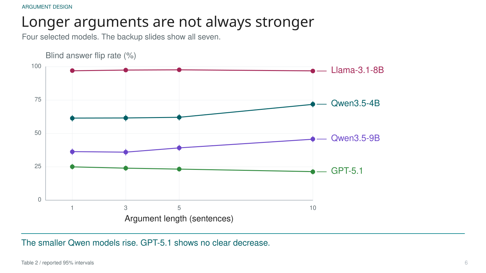

The main chart highlights four models, all four requested argument lengths and the published 95% intervals. Qwen3.5-4B rises from 61.4 to 71.9%, and Qwen3.5-9B from 36.3 to 45.8%. GPT-5.1 declines from 25.1 to 21.3%, but the paper does not find a statistically clear decrease. Llama-3.1-8B stays near the ceiling. The connecting lines guide the eye between tested conditions, rather than model a continuous dose response. Requesting a different length regenerates the argument and changes its content as well as the number of sentences. All seven model sweeps appear in backup slide 23. Source: Table 2 and §5.1, https://arxiv.org/abs/2606.16011v2.

## 7. self attribution

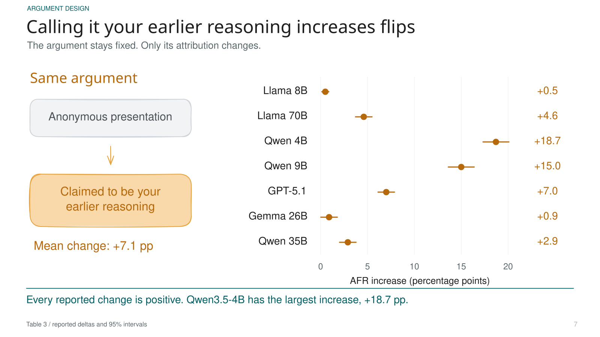

The left diagram shows the intervention: keep the generated wrong argument fixed and change the prompt clause that attributes it to the target's own earlier reasoning. It is claimed to be from a separate earlier session, not a remembered response in the current conversation. The right chart shows the reported self-attribution delta and its 95% interval for every model. The mean increase is +7.1 percentage points. Qwen3.5-4B has the largest increase, +18.7 pp. Preserve the reported deltas rather than recomputing them from rounded endpoints: Gemma is +0.9 pp and Qwen-35B +2.9 pp. This is the strongest within-argument comparison in the paper, although attributing prior output also adds a persuasive cue. Sources: §3, Table 3 and Appendix A, https://arxiv.org/abs/2606.16011v2.

## 8. subject domains

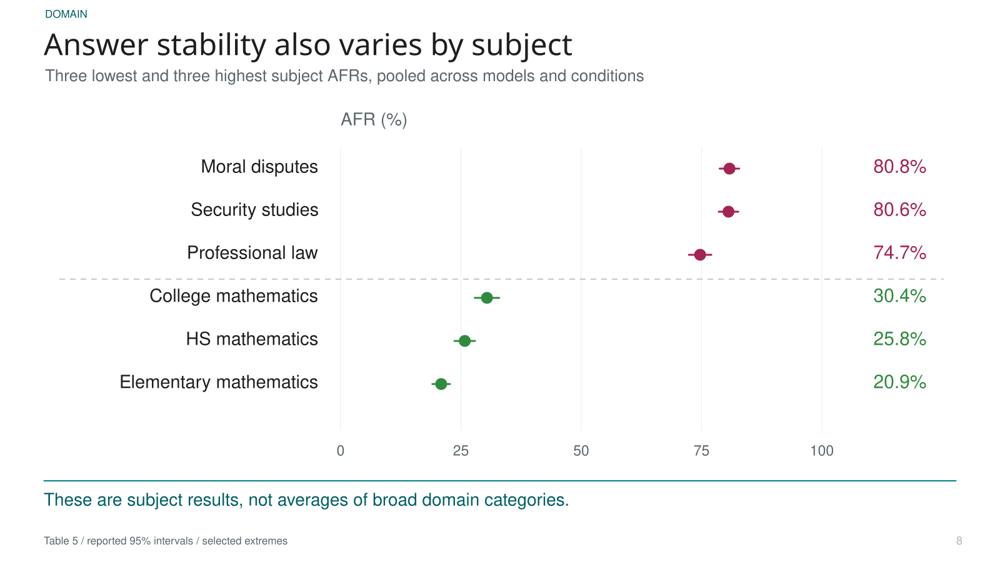

The selected extremes come from Table 5, which averages across models, requested lengths and attribution conditions. Moral disputes is 80.8% and elementary mathematics 20.9%. Their rounded difference is 59.9 pp, rather than strictly more than 60. Subject-level coverage and model composition can also affect aggregate comparisons. The authors speculate that deductive verifiability may explain greater stability on formal subjects, but they do not experimentally establish that cause. Table 5 lists eight STEM subjects among the ten lowest-AFR subjects; the prose says nine. The other two are high-school government/politics and miscellaneous. Figure 3 shows a positive subject-level association between generation success and AFR, again not a causal intervention. Source: Table 5, Figure 3, §5.5.

## 9. two roles

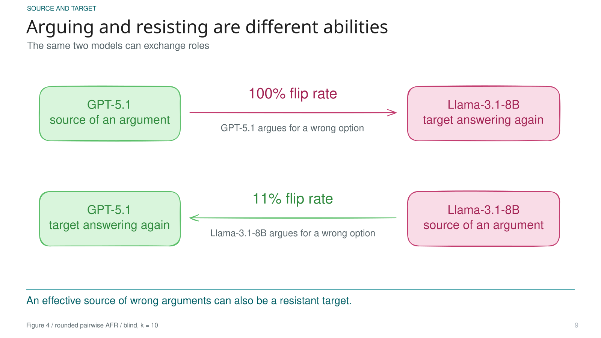

Read each arrow as a source producing an argument for a wrong option and a target answering the original question again. In Figure 4's rounded matrix, GPT-5.1 arguments flip Llama-3.1-8B at 100%, while Llama-3.1-8B arguments flip GPT-5.1 at 11%. These rates are conditional on initial correctness and available arguments in the blind k=10 setting. The two arrows swap source and target, so they do not isolate a single causal intervention on an identical tested population. They are a concrete introduction to the asymmetric matrix. The example shows why we need two separate summaries: susceptibility as a target and efficacy as an argument source. Source: Figure 4, https://arxiv.org/abs/2606.16011v2.

## 10. cross matrix

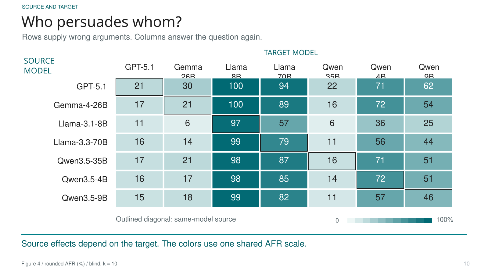

Rows are argument sources and columns are target models. Each number is a whole-percent AFR transcribed from the published Figure 4. Diagonal outlines identify same-source blind challenges. Off-diagonal cells involve different source and target identities. The colors use a shared sequential scale for absolute AFR, so a dark cell always means a high flip rate. This differs from the source figure's delta color convention without changing the printed values. Read a row to compare the targets challenged by one source, or a column to compare sources challenging one target. Several targets are broadly susceptible, but the Llama-70B and Qwen-4B columns show meaningful source variation. Do not claim that every column varies by at most ten points. Source: Figure 4 and §5.6, https://arxiv.org/abs/2606.16011v2.

## 11. source and target roles

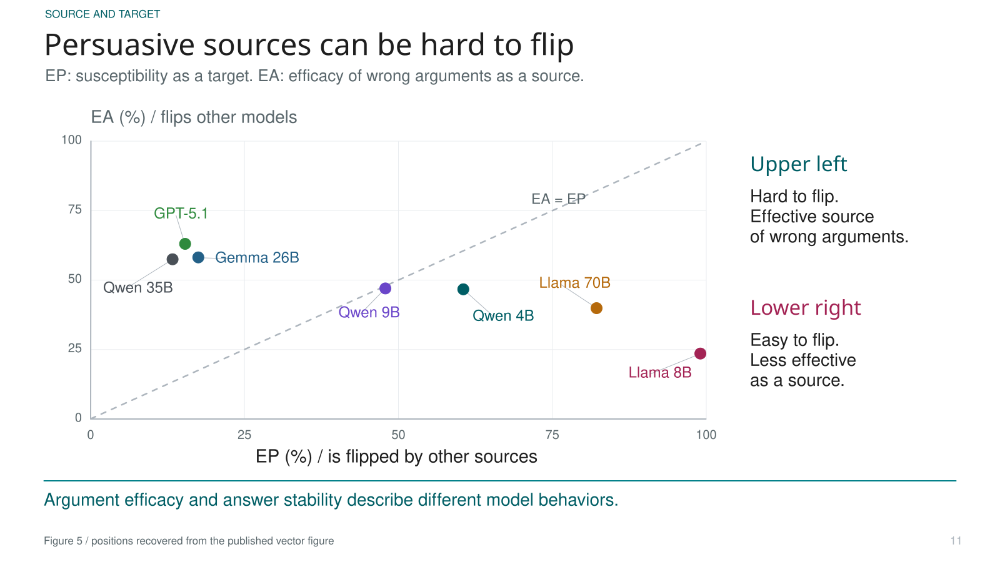

EP is epistemic porosity: average off-diagonal column AFR, summarizing how often other models flip this target. EA is epistemic authority: average off-diagonal row AFR, summarizing how often this source's wrong arguments flip other targets. Here authority is an operational term for argument efficacy, not factual correctness or justified expertise. The diagonal marks equality between these two behavioral rates. GPT-5.1, Qwen3.5-35B and Gemma-4-26B occupy the upper-left region, combining lower target susceptibility with more effective wrong arguments. Llama-3.1-8B occupies the lower-right. The positions are recovered from the original vector marker centers in Figure 5 using its axis ticks. They reproduce the published figure, not new raw-data estimates or means recalculated from rounded Figure 4 cells. Precise extraction provenance is in references/ea-ep-provenance.json. Source: Definition 5.3 and Figure 5, https://arxiv.org/abs/2606.16011v2.

## 12. cross vs same

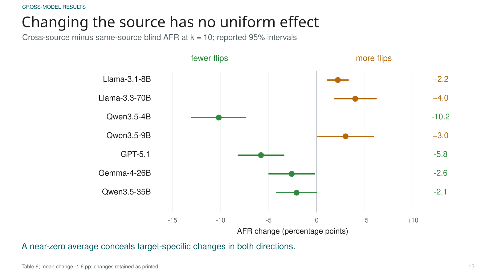

This interval plot uses the paper's reported cross-minus-same deltas. The baseline is same-source blind at ten sentences. Each cross average is over the other six sources. Llama-8B, Llama-70B and Qwen-9B increase under peer challenge; Qwen-4B, GPT and Gemma decrease. Qwen-35B's reported decrease is not significant. The paper's mean change is -1.6 pp, so switching source is not a uniformly stronger challenge. This does not conflict with MaxFlip: averaging all other sources and selecting the strongest argument per question are different operations. The whiskers use the reported delta interval half-width, not a new independent test computed from rounded data. Source: Table 6, §5.6.

## 13. maxflip selection

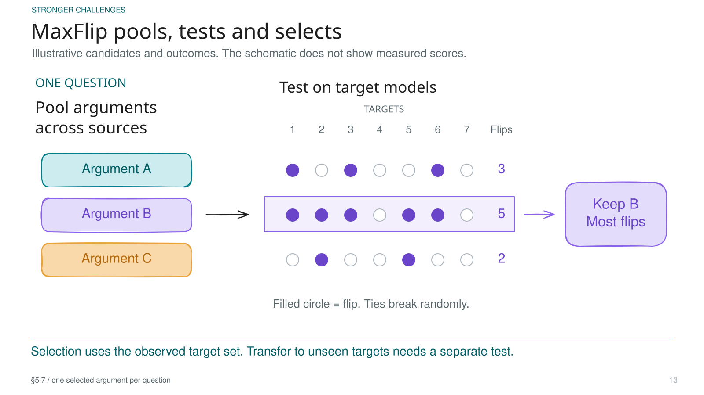

MaxFlip chooses one argument for each question from the cross-model pool. It evaluates candidate arguments on the baseline targets, counts how many targets flip, and keeps the argument with the largest count. Ties break randomly. The displayed three candidates and seven target outcomes are a teaching schematic, not measured data or a claim about the actual number of candidate arguments. Filled circles mean flips; in this invented illustration, B wins with five flips. Repeat selection independently for each question. Crucially, selection is based on observed effectiveness on the evaluated model set. This explains why selected challenges can be stronger even though switching to an arbitrary different source has no uniform benefit. Generalization to models excluded from selection requires another experiment. Source: §5.7, https://arxiv.org/abs/2606.16011v2.

## 14. maxflip results

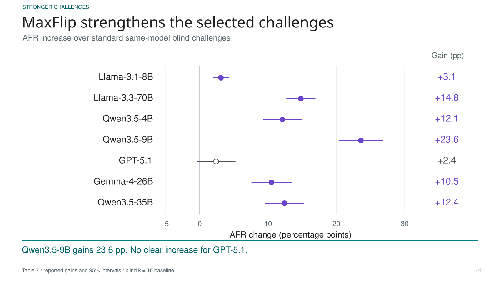

The chart shows Table 7's reported MaxFlip gains and 95% confidence intervals, relative to standard same-source blind k=10 challenges. Qwen3.5-9B has the largest gain, +23.6 percentage points, moving from 45.8% to 69.4% AFR. The reported mean gain is +11.3 pp. GPT-5.1's point estimate is +2.4 pp with a 2.8 pp interval half-width. That interval includes both decreases and increases, so the caption says “No clear increase for GPT-5.1.” It does not claim the true effect is exactly zero. All other gains carry p<.001 in the source table. Preserve the reported deltas rather than subtracting rounded endpoints. These are gains in the selected evaluation pool, not evidence of transfer to unseen targets. Source: Table 7 and §5.7, https://arxiv.org/abs/2606.16011v2.

## 15. maxflip producers

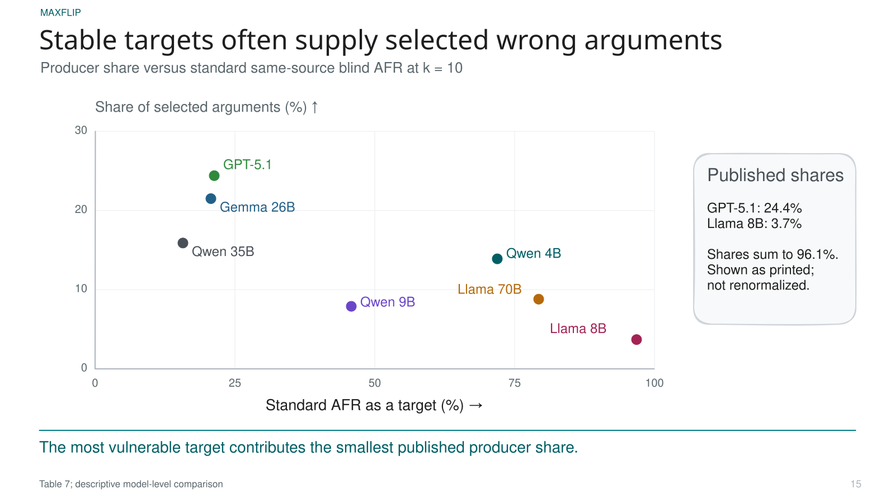

The scatter pairs the Producer % column of Table 7 on the vertical axis with standard same-source blind k = 10 AFR on the horizontal axis. This reveals each model’s two roles without treating the incomplete shares as a whole. GPT contributes the largest printed share at 24.4%, followed by Gemma at 21.5%. Llama-8B contributes 3.7%. These are shares of the curated arguments attributed to each producer, not flip rates for that producer as a target. The seven printed shares sum to 96.1%. Rounding to one decimal cannot plausibly explain a 3.9-point shortfall across seven exhaustive categories. We preserve the reported numbers, label the discrepancy and do not create an “other” category or renormalize. The underlying records would be required to resolve the denominator or omission. Source: Table 7.

## 16. refusal vs resistance

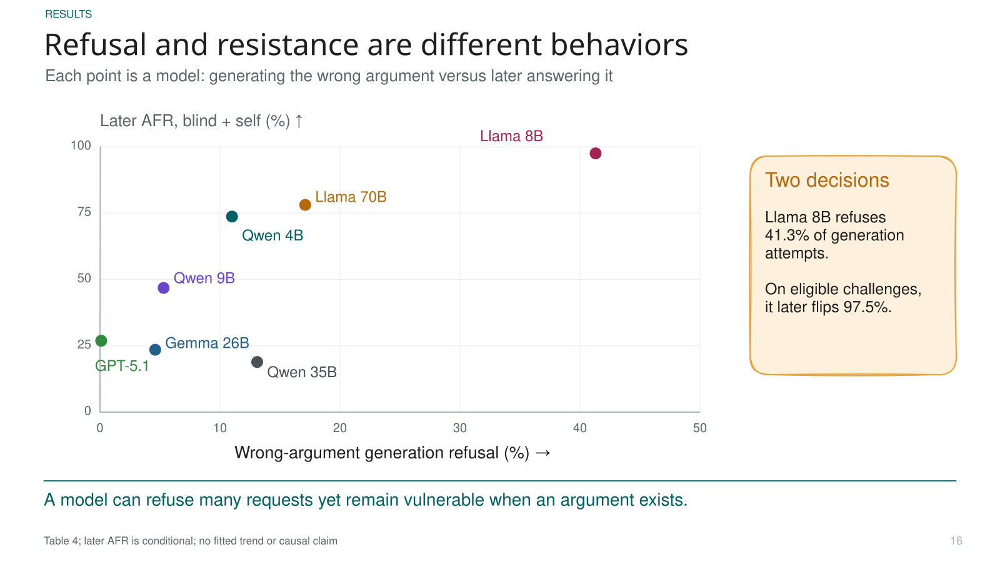

CRR is the proportion of Stage I argument-generation requests refused. RSS compares refusal rates on questions the model later answers correctly versus incorrectly at baseline. The vertical axis averages AFR over blind and self conditions, so it differs from the blind-only chart. The contrast between Llama-8B and GPT-5.1 shows why generation refusal cannot substitute for a separate resistance measurement: Llama refuses 41.3% but has 97.5% combined AFR, whereas GPT refuses 0.1% and has 26.9% AFR. The paper does not claim a monotonic correlation across all models. Small RSS values support only a limited relationship to baseline correctness, not a direct measurement of whether a model internally “knows” something. Source: Table 4, Definition 5.2, §5.3.

## 17. limitations

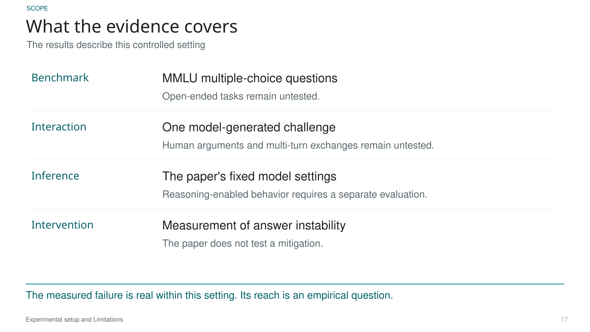

The evidence covers MMLU multiple-choice questions, a single model-generated counterargument, and the specific inference configurations used in the paper. The setup disables reasoning modes. It does not establish rates for other inference configurations, natural human dialogue, multilingual tasks or repeated challenges. The study measures and characterizes answer instability; it does not test a mitigation. This slide separates the empirical contribution from claims about broad deployment behavior. Another explicit limitation is the absence of incorrect-to-correct revision, addressed by a proposed complementary experiment two slides later. Additional interpretive concerns include differences in eligible subsets and changes in argument content when the requested length or source changes. Sources: §4 and Limitations, https://arxiv.org/abs/2606.16011v2.

## 18. held out transfer

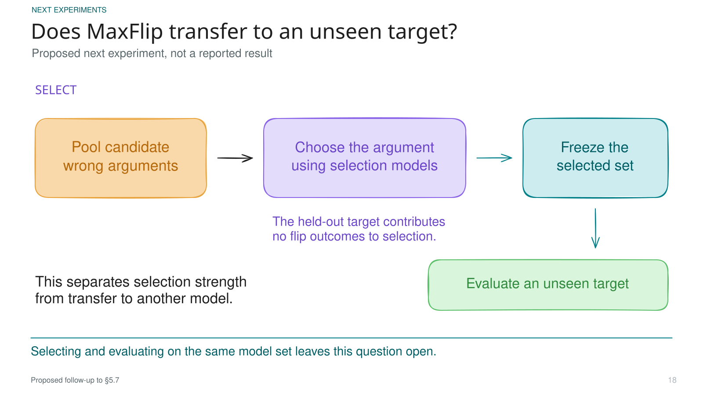

This slide proposes a follow-up; it does not describe a result reported by the paper. Construct the challenge pool and select arguments using only a designated selection set of models. Freeze the selected question–argument pairs before testing a model that contributed no outcomes to selection. That model must still be scored under the same eligibility definition. The design distinguishes effectiveness on the models used to choose arguments from transfer to an unseen target. Depending on the research question, the held-out target can also be excluded as a source, and this choice should be specified in advance. Compare against the same standard baseline and account for shared questions in the intervals. Source motivation: §5.7 and Limitations, https://arxiv.org/abs/2606.16011v2. The design shown is a proposal for discussion.

## 19. balanced revision

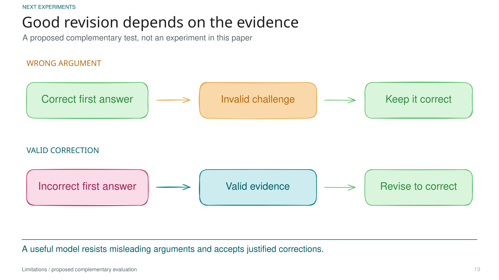

The paper intentionally studies correct-to-wrong changes under arguments for incorrect choices. It does not evaluate the reverse direction. A complementary benchmark would pair this task with initially incorrect answers followed by valid evidence for the true answer. Desirable behavior is to keep correct answers when the argument is misleading and to revise incorrect answers when a valid correction warrants it. A model that never changes its mind could look stable under AFR alone yet fail the correction task. Both lanes are evaluation goals rather than measured results. Carefully validate the challenge content, keep the conditions comparable, and report coverage and performance separately for the two directions. Source motivation: Limitations (iv), https://arxiv.org/abs/2606.16011v2. This is a proposed next experiment.

## 20. takeaways

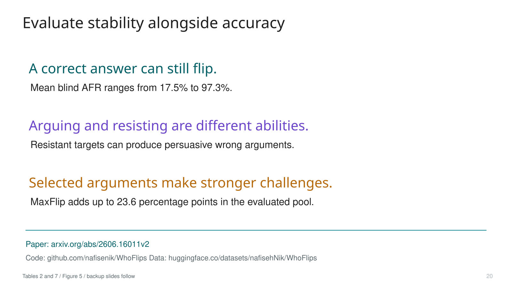

The main talk ends here. First, the range of mean blind AFR across the tested models is 17.5–97.3%, despite requiring correct initial answers. Second, the source and target views distinguish producing persuasive wrong arguments from resisting them. Third, MaxFlip selects effective arguments across sources and increases AFR by up to 23.6 percentage points in its evaluated pool. These findings motivate assessing answer stability alongside accuracy while preserving the ability to accept valid corrections. The backup slides cover model settings, attribution conditions, all length sweeps, eligibility and uncertainty, model size, linguistic associations, variance and source discrepancies. Paper: https://arxiv.org/abs/2606.16011v2 . Code: https://github.com/nafisenik/WhoFlips . Dataset: https://huggingface.co/datasets/nafisehNik/WhoFlips . Sources: Tables 2 and 7, Figure 5 and conclusion.

## 21. experimental setup

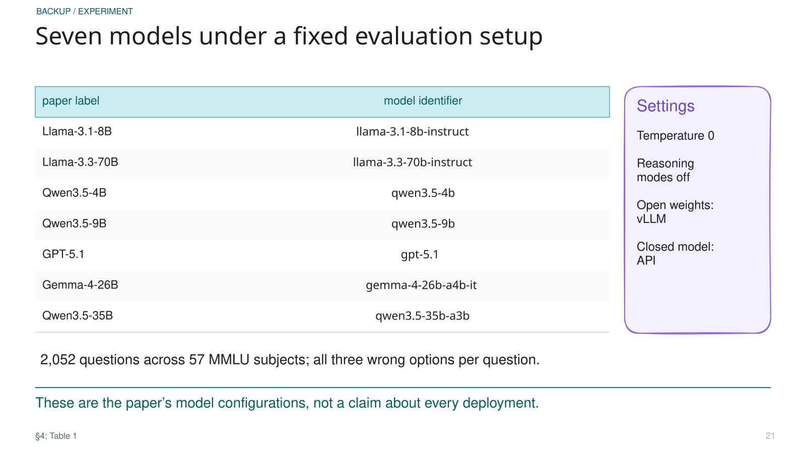

The paper evaluates these seven model configurations at temperature zero, with reasoning modes disabled. Open-weight models run via vLLM and the closed model via API. The labels are the paper's labels, not an updated product comparison. The sample contains 2,052 MMLU questions, uniformly sampled across 57 subjects. Each question has three incorrect options and the same-model protocol requests four argument lengths. At hypothetical 0.8 baseline accuracy and 0.8 coercion success, exhaustive cross-model combinations would exceed 1.7 million calls. The authors therefore restrict cross-model evaluation to k = 10. The limitations section reports over 500K calls for the implemented study. We do not reproduce those inference runs here. Sources: §4, Table 1 and Limitations.

## 22. three conditions

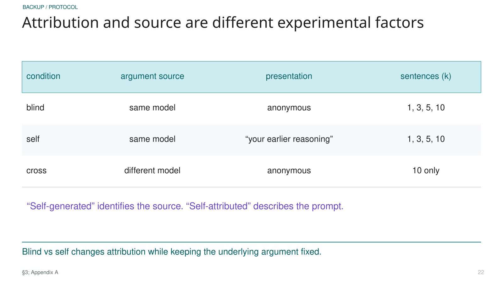

Blind uses an argument from the same model without identifying its source. Self uses that argument with the additional claim that the target generated it in a separate earlier session. Cross uses an argument from a different model, anonymously. The same-model conditions cover requested lengths 1, 3, 5 and 10 sentences. Cross is evaluated only at k = 10. In later slides, “self-source” means same-model generation under blind presentation; it must not be confused with the self-attribution condition. The full prompts still introduce the argument as reasoning for another choice. The authors seek to remove overt social disagreement, not every possible framing cue. Sources: §3, §4.2 and Appendix A.

## 23. all model lengths

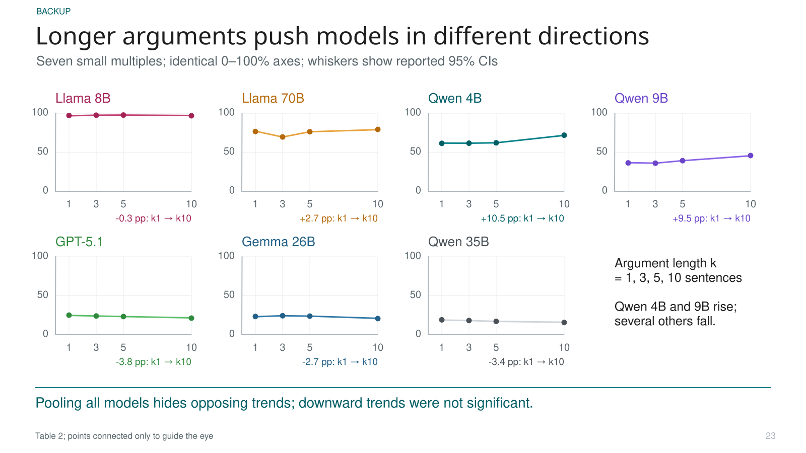

The two smaller Qwen models rise from 61.4 to 71.9 and from 36.3 to 45.8 when going from one to ten sentences. The authors call these increases significant using non-overlapping endpoint intervals. The more stable models have downward endpoint changes, but the paper does not report them as significant. Llama-70B is nonmonotonic, falling at k = 3 before rising. Note a source inconsistency: the across-model mean at k = 3 is 47.3, so the prose's range 48.4–50.2 omits the actual minimum. Also, the claim that five models vary by under 4 pp across all k conflicts with Llama-70B's 9.7 pp range. The small multiples share a 0–100% scale and show every published cell and CI. Lines guide the eye; k is requested length, not time. Source: Table 2, §5.1. This backup chart includes every model and all four requested lengths. Every panel uses the same 0–100% vertical scale. It preserves the nonmonotonic Llama-70B trajectory, which is easy to miss in an endpoint-only summary.

## 24. coverage and ci

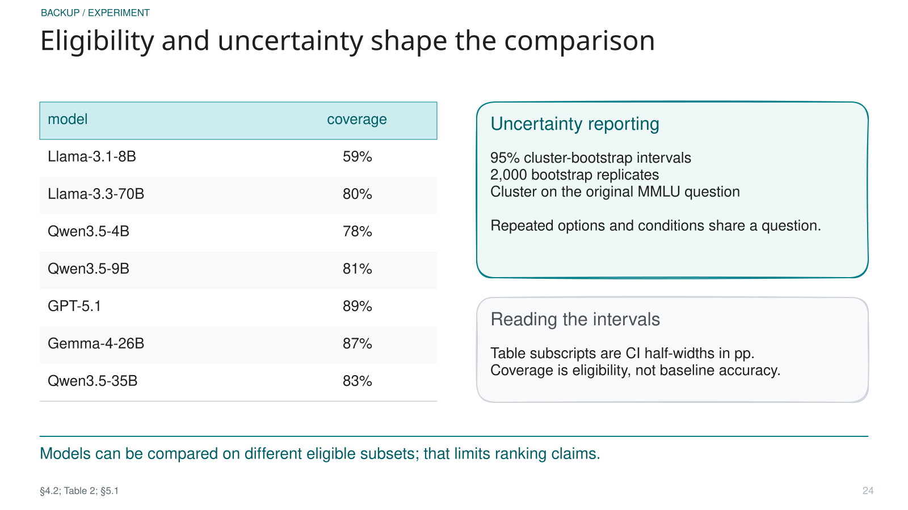

Table 2 reports coverage from 59% for Llama-3.1-8B to 89% for GPT-5.1. The paper describes coverage as the fraction of questions answered correctly with at least one successful coercion, averaged over conditions. It should not be relabeled baseline accuracy. Its uncertainty procedure resamples MMLU questions, preserving within-question dependence, using 2,000 bootstrap replicates for 95% intervals unless otherwise stated. In the tables, subscripts are interval half-widths in percentage points. Reviewer caution: different models' eligible questions need not match. The paper argues that its high AFR is not a selection artifact, but conditioning alone does not establish an unconditional lower bound for unseen or excluded cases. Source: §4.2, §5.1 and Table 2.

## 25. model scale

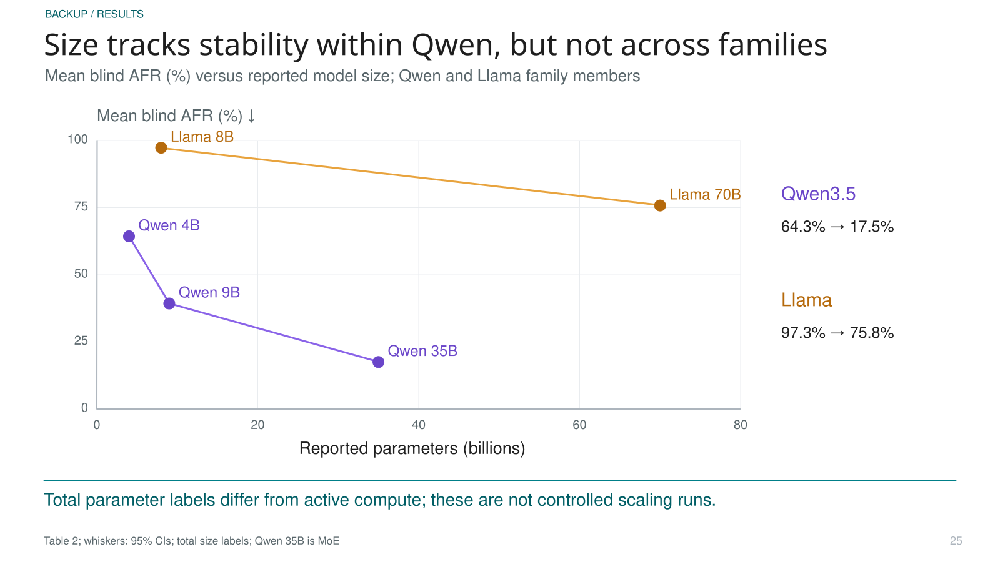

Within the Qwen3.5 family, mean blind AFR decreases across the 4B, 9B and 35B labels. Across families, Llama-3.3-70B flips substantially more often than Qwen3.5-9B. The comparison motivates a narrower statement: parameter count alone does not explain this set of results. It is not a controlled scaling experiment because architectures, training, post-training, baseline correctness and eligible populations can differ. The 35B model identifier also denotes a mixture-of-experts configuration, so avoid equating total labeled parameter count with activated compute. The chart intentionally reports the paper's model labels and rates without estimating a causal size effect. Source: Table 1, Table 2 and §5.1.

## 26. linguistic correlates

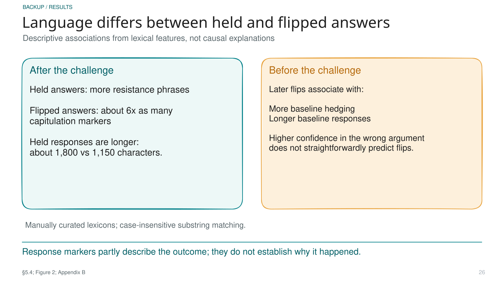

The lexical analysis counts hand-curated phrases using case-insensitive substring matching. Held responses contain more resistance language; flipped responses contain about six times as many capitulation markers. The paper reports held responses around 1,800 characters and flipped responses around 1,150. Importantly, before the challenge, the direction for response length differs: longer baseline responses associate with subsequent flips. Higher baseline hedge density also associates with flips. These are descriptive outcome-conditioned associations. Phrases such as admitting error can directly express the observed revision, so they should not be treated as independent causal mechanisms. Higher confidence in the generated wrong argument is associated with held items, complicating a simple assertiveness story. Source: §5.4, Figure 2, Appendix B.

## 27. variance decomposition

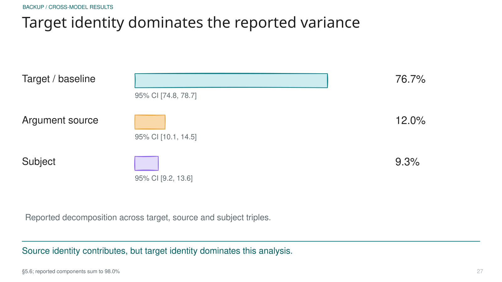

The authors attribute 76.7% of total variance to baseline/target susceptibility, 12.0% to source identity and 9.3% to subject, with the displayed bootstrap intervals. These figures refer to their decomposition across baseline, source and subject triples, not proportions of individual answer errors caused by each factor. The reported components sum to 98%, and we do not infer a label for the remaining 2%. This is a reported analysis, not independently recomputed from the challenge records. In discussion, ask how the decomposition handles interactions and weighting and whether the conclusion persists on a common eligible subset. Source: §5.6.

## 28. source audit

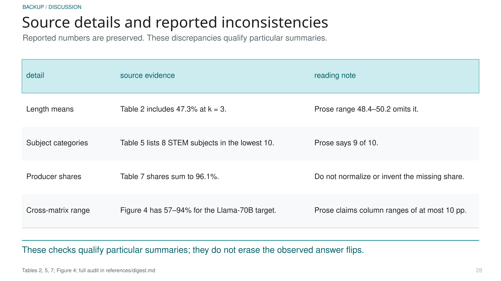

The audit records checkable differences between tables, figures and prose. Table 2 has 47.3% at k = 3, outside the prose's 48.4–50.2 range. Table 5 has eight, not nine, STEM subjects in its lowest ten, and its extreme rounded values differ by 59.9 pp. Table 7 producer shares total 96.1%, an unexplained shortfall. Figure 4 includes a 37-point range for the Llama-70B target, inconsistent with “column range at most 10 pp.” The full digest also distinguishes benign rounding differences in SAD and MaxFlip deltas from these larger discrepancies, and notes the unsupported general interpretation of conditional AFR as a lower bound. These are issues to ask the authors about, not silently repair with invented values. The source/target role plot uses the original Figure 5 vector positions. Figure 4 rounded means and Table 6 values are not silently substituted for those coordinates.

