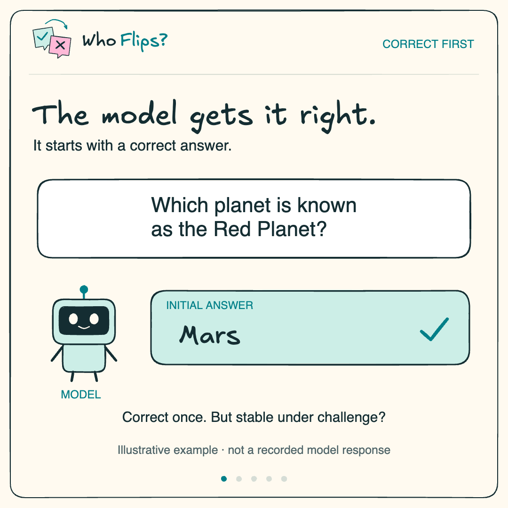

# Who Flips? — animated explainer

A **45.1-second, 1080 × 1080** Excalidraw animation, narrated by **Hope — Natural, Clear and Calm** from ElevenLabs.

[](who-flips.mp4)

| Material | File |
|---|---|
| Final narrated animation, H.264/AAC, 30 fps | [who-flips.mp4](who-flips.mp4) |
| Silent looping animation | [who-flips.gif](who-flips.gif) |
| Local browser player | [index.html](index.html) |
| Editable Excalidraw storyboard | [storyboard.excalidraw](storyboard.excalidraw) |
| Editable scene files | [excalidraw/](excalidraw/) |
| Vector scene exports | [svg/](svg/) |
| Narration and timing | [script](narration-script.txt) · [timing](narration-timing.json) |
| Final audio and original voice takes | [audio/](audio/) |
| Animation source | [source/scenes.json](source/scenes.json) |
| Suggested post text | [post-caption.txt](post-caption.txt) |

Download the folder and open `index.html` to play it locally. A GIF has no audio; use the MP4 for the narrated version.

## Story

The model answers correctly → a misleading argument challenges it → does it hold or flip? → reported differences across models → **Evaluate stability alongside accuracy.**

The Mars/Venus dialogue illustrates the protocol; it is not a recorded model response. The 17.5%–97.3% range reports mean blind answer flip rates among eligible, initially correct answers, averaged over the tested argument lengths. No new model experiments were run. See the [paper](https://arxiv.org/abs/2606.16011) and the [source audit](../references/digest.md).

## Edit and rebuild

The drawings, labels and logo are native editable Excalidraw elements. Open `storyboard.excalidraw` or a scene file in [Excalidraw](https://excalidraw.com). For repeatable exports, edit `source/scenes.json`; this file also controls the animation entrances and scene lengths. Editing an exported `.excalidraw` file does not update the generator.

The renderer reuses the slide deck's pinned Excalidraw dependencies. From `2026-10-09-who-flips/`, after setting up the Node dependencies in the [parent README](../README.md):

```bash
python -m pip install -r video/tools/requirements.txt
export CHROMIUM_PATH="/path/to/chrome-or-chromium"
python video/tools/build.py
```

`NODE` and `FFMPEG` may optionally point to their executables. Otherwise the build uses `node` and the FFmpeg binary provided by `imageio-ffmpeg`. Temporary frames are stored in ignored `video/.build/`. The build recreates the Excalidraw/SVG exports, the MP4, and the silent GIF using the saved final narration; it does not call ElevenLabs or spend generation credits.

For a different voice or script, replace `audio/narration.wav` and update the scene/timing files. The original five MP3 takes are included for editing.

## Voice credit

Voice: **Hope — Natural, Clear and Calm**, [ElevenLabs](https://elevenlabs.io/app/voice-library?voiceId=OYTbf65OHHFELVut7v2H), model Eleven v4, stability 50%, similarity 75%. This is a stock synthetic voice, not a clone of a paper author. Speech was generated through the signed-in ElevenLabs website and normalized before the final edit.
